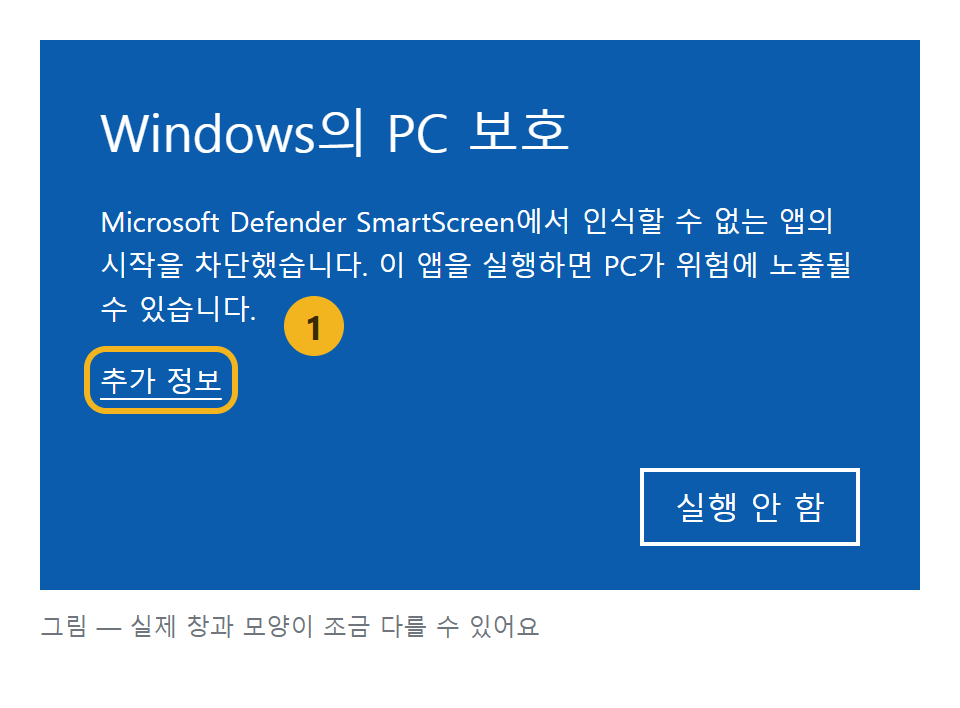
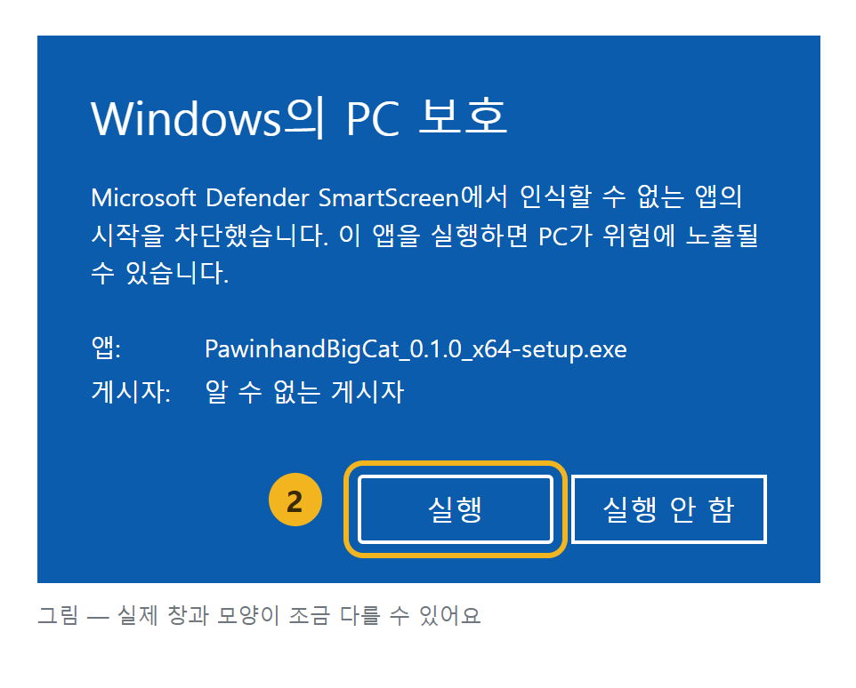

# 포인핸드 대형묘 찾기

[포인핸드](https://pawinhand.kr)에 보호 중인 고양이 가운데 몸무게가 기준(기본 8kg) 이상인 아이만 모아 보여주는 Windows 앱입니다.

> **포인핸드 공식 앱이 아닙니다.** 포인핸드에 공개된 보호 동물 공고를 모아 보여줍니다. 입양 문의와 신청은 포인핸드나 각 보호소에서 하세요.

- 켜면 포인핸드에서 보호 중인 고양이를 모두 받아, 몸무게가 기준 이상인 아이만 무거운 순으로 보여줍니다
- 몸무게 기준·등록 기간·지역·정렬을 바꾸면 바로 다시 거릅니다
- 카드를 누르면 사진과 정보를 모두 보고, 「포인핸드에서 보기」로 그 아이의 포인핸드 페이지를 엽니다

## 설치

Windows 10·11(64비트)에서 돌아갑니다. 관리자 권한은 필요 없습니다.

1. [Releases](https://github.com/HoyoungParkme/fourinhand-crawl/releases/latest)에서 `PawinhandBigCat_{버전}_x64-setup.exe`를 내려받습니다(2MB 남짓)
2. 내려받은 파일을 실행합니다
3. 파란 창 「Windows의 PC 보호」가 뜨면 **추가 정보**를 누른 뒤 나타나는 **실행**을 누릅니다

   | ① 「추가 정보」를 누른다 | ② 「실행」을 누른다 |
   |---|---|
   |  |  |

   - 이 앱은 코드 서명을 하지 않아서 처음 보는 앱으로 경고가 뜹니다. 설치 파일은 이 저장소의 GitHub Actions가 소스 코드에서 바로 만든 것입니다
   - 경고 대신 「파일 열기 - 보안 경고」 창이 뜨면 **실행**을 누릅니다
4. 설치 마법사를 따라 설치합니다. 관리자 권한을 묻지 않습니다. 끝나면 시작 메뉴에 「포인핸드 대형묘 찾기」가 생깁니다(마지막 화면에서 고르면 바탕 화면에도)

화면을 그리는 Microsoft Edge WebView2가 PC에 없으면 설치 중에 인터넷에서 받아 설치합니다(Windows 11에는 들어 있습니다).

### 새 버전으로 바꾸기

새 버전의 `setup.exe`를 받아 실행합니다. 설치 마법사가 깔려 있는 이전 버전을 알아보고 「설치하기 전에 제거하기」를 골라 둔 채 묻습니다 — 그대로 **다음**을 누르면 이전 버전을 지우고 새 버전을 깝니다. 따로 먼저 지울 필요가 없습니다.

### 지우기

설정 → 앱 → 설치된 앱에서 「포인핸드 대형묘 찾기」를 찾아 **제거**를 누릅니다. 제거 마법사에서 「애플리케이션 데이터 삭제하기」를 고르면 불러온 사진 캐시까지 지웁니다.

## 데이터와 개인정보

- 받아온 목록은 PC에 저장하지 않습니다. 켤 때와 새로고침할 때마다 포인핸드에서 새로 받습니다
- 로그인·사용 통계·오류 보고가 없습니다. 앱이 연결하는 곳은 포인핸드 목록, 사진(국가동물보호정보시스템·포인핸드), 그리고 누른 링크뿐입니다
- 포인핸드 목록은 공개·문서화된 API가 아니라서, 포인핸드가 사이트를 바꾸면 앱이 목록을 받지 못할 수 있습니다. 그때는 새 버전이 나왔는지 확인하세요

## 개발

명세가 먼저입니다. 무엇을 왜 이렇게 만들었는지는 [`docs/specs/`](docs/specs/)(싱크독 프로젝트 `PAW`)에 있고, 코드는 명세를 따릅니다.

| 폴더 | 내용 |
|---|---|
| `backend/` | 코어(Rust)와 Tauri 설정 — 받아오기·몸무게 해석·거르기·링크 열기 |
| `frontend/` | 화면(React + TypeScript + Vite) |
| `scripts/` | 개발 실행·설치 파일 만들기 |
| `docs/specs/` | 명세 |

### 준비 (Windows, 한 번)

- Node.js 24
- Rust stable(MSVC): `winget install Rustlang.Rustup`
- Visual Studio 2022 Build Tools의 「C++를 사용한 데스크톱 개발」: `winget install Microsoft.VisualStudio.2022.BuildTools --override "--wait --passive --add Microsoft.VisualStudio.Workload.VCTools --includeRecommended"`

### 명령 (저장소 루트에서)

| 할 일 | 명령 |
|---|---|
| 개발 실행 | `pwsh scripts/dev.ps1` |
| 설치 파일 만들기 | `pwsh scripts/build.ps1` → `backend/target/release/bundle/nsis/PawinhandBigCat_{버전}_x64-setup.exe` |
| 코어 테스트 | `cd backend; cargo test` |
| 실데이터 점검(실제 포인핸드에 요청) | `cd backend; cargo test -- --ignored` |

처음 설치 파일을 만들 때 Tauri가 NSIS를 `%LOCALAPPDATA%\tauri`에 받아 풉니다. 백신이 막 푼 파일을 검사하느라 「액세스가 거부되었습니다(os error 5)」로 멈추면 `build.ps1`이 반쯤 풀린 폴더를 지우고 잠시 뒤 한 번 더 만듭니다. 그래도 멈추면 조금 뒤 다시 실행하세요.

### 새 버전 내기

1. `backend/tauri.conf.json`의 `version`을 올립니다 — 버전은 여기 한 곳에서만 관리합니다
2. 배포 전에 실데이터 점검을 돌립니다
3. 같은 값으로 태그를 올립니다: `git tag v0.1.1 && git push origin v0.1.1`
4. GitHub Actions가 설치 파일을 만들어 같은 이름의 Release에 올립니다. 태그와 설정의 버전이 다르거나 설치 파일이 20MB를 넘으면 Release를 만들지 않습니다

## 글꼴

화면 글꼴은 [SUIT](https://github.com/sun-typeface/SUIT)(© SUNN)이고 SIL Open Font License 1.1을 따릅니다 — [`frontend/src/assets/fonts/SUIT-OFL.txt`](frontend/src/assets/fonts/SUIT-OFL.txt).
