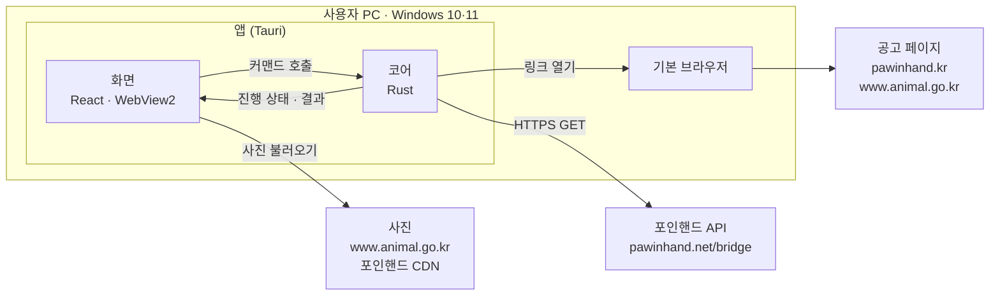
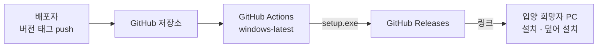

# 인프라 아키텍처

## 0. 이 문서가 다루는 것

앱이 어떤 부품으로 되어 있고, 어디와 통신하고, 무엇을 어디에 두고, 설치 파일을 어떻게 만들어 나눠 주는지를 정한다. 코드 폴더·클래스는 클래스 명세(DOM)가, 화면은 UI 문서가, 화면과 코어 사이 호출의 정확한 모양은 API 문서가 정한다.

버전·주소·건수는 모두 **2026-09-30에 직접 확인한 값**이다.

| 이름 | 값 |
|---|---|
| 보이는 이름(시작 메뉴·설치 마법사·창 제목) | 포인핸드 대형묘 찾기 |
| 영문 이름(실행 파일·설치 파일) | `PawinhandBigCat` |
| 앱 식별자(identifier) | `io.github.hoyoungparkme.pawinhandbigcat` — 이후 바꾸지 않는다(C4) |

## 1. 제약

설계를 묶는 조건이다. 각 제약의 출처를 따라가면 왜 그런지 나온다.

#### C1 서버 없이 사용자 PC 안에서 끝난다

출처: [[PAW-PRD-001#G2]]

PRD 비목표 「자체 서버·DB」. 앱이 포인핸드에 직접 묻고, 받은 데이터는 앱 메모리에만 둔다. 운영할 서버·DB·계정이 없다.

#### C2 Windows 10·11 64비트, 개발 도구 없는 PC에서 돈다

출처: [[PAW-PRD-001#N4]] · [[PAW-PRD-001#G2]]

받는 사람 PC에 Node·Rust·파이썬이 없다고 본다. 앱이 필요로 하는 것은 WebView2 하나이고, 없으면 설치 파일이 받아 깐다(C4).

#### C3 Tauri로 만들고 Windows에서 개발한다

출처: [[PAW-RFQ-001#Q8]]

WSL에서는 리눅스용 결과물이 나오고 화면을 그리는 엔진도 달라서 쓰지 않는다. 개발 PC와 CI 모두 Windows에서 빌드한다.

#### C4 설치 파일은 20MB 이하, 관리자 권한 없이, 덮어 설치된다

출처: [[PAW-PRD-001#R11]] · [[PAW-PRD-001#N3]]

- 현재 사용자 설치(Tauri NSIS `installMode: currentUser`, 기본값)라 관리자 권한이 필요 없다
- WebView2는 필요할 때만 내려받는다(`webviewInstallMode: downloadBootstrapper`, 기본값). 오프라인 설치본을 넣으면 크기가 20MB를 크게 넘는다
- 덮어 설치는 앱 식별자가 같아야 된다. 식별자는 `io.github.hoyoungparkme.pawinhandbigcat`이고 **한 번 정한 뒤 바꾸지 않는다** — 바꾸면 이미 설치한 사람에게 새 버전이 덮어 설치되지 않고 따로 하나 더 깔린다

#### C5 코드 서명을 하지 않는다

출처: [[PAW-RFQ-001#Q8]]

설치할 때 「Windows의 PC 보호」 경고가 뜬다. README에 넘기는 법을 그림과 함께 적는다([[PAW-PRD-001#R12]]). 자동 업데이트 기능은 쓰지 않는다(PRD 비목표).

#### C6 데이터 원천은 포인핸드의 비공식 API다

출처: [[PAW-RFQ-001]]

`https://pawinhand.net/bridge/animals/condition`은 포인핸드 사이트가 내부적으로 쓰는 주소이고, 공개·문서화된 API가 아니다. 주소나 응답 형식이 예고 없이 바뀌거나 막힐 수 있다. 앱은 응답을 검사해 실패로 알리고([[PAW-UC-001#UC-S1]] 2b), 배포자가 고쳐 새 버전을 낸다([[PAW-UC-001#UC-A1]]). 포인핸드에 사용 문의는 하지 않기로 했다(고객 결정, 9.1) — 이 위험은 그대로 남는다. 참고로 `pawinhand.kr/robots.txt`는 `Allow: /`이고, `pawinhand.net`에는 robots.txt가 없다(404).

#### C7 포인핸드에 부담을 주지 않는다

출처: [[PAW-PRD-001#N2]]

- 요청은 한 번에 하나씩, 앞 요청이 끝나고 0.3초 뒤에 보낸다. 한 요청은 15초가 넘으면 실패로 본다
- 요청은 켤 때와 새로고침·다시 시도 때만 나간다. 한 번에 5번 안팎(4,225건 ÷ 1000건)
- 요청 머리의 User-Agent에 앱 이름·버전·저장소 주소를 밝힌다: `PawinhandBigCat/{버전} (+https://github.com/HoyoungParkme/fourinhand-crawl)`. 이런 형식(앱 이름/버전 + 저장소 주소)으로 보냈을 때 정상 응답하는 것을 확인했다

#### C8 조건 값의 공백은 + 기호로 인코딩한다

출처: [[PAW-PRD-001#R1]]

`모든 지역`의 공백을 `%20`으로 보내면 빈 배열이 온다. 쿼리는 폼 인코딩(공백 → `+`)으로 만들고, 인코딩 결과를 단위 테스트로 고정한다.

#### C9 원문 공고 주소는 받은 그대로 쓰지 않고 새로 만든다

출처: [[PAW-UC-001#UC-S4]] · [[PAW-PRD-001#R9]]

받아온 `detail_url`은 세 종류다.

| 종류 | 건수 | 예 | 열면 |
|---|---|---|---|
| 국가동물보호정보시스템 옛 주소 | 3,715 | `http://www.animal.go.kr/portal_rnl/abandonment/public_view.jsp?desertion_no=445471202600372` | 그 아이가 아니라 **첫 화면**(`/front/index.do`)으로 넘어간다 |
| 포인핸드 상세 | 503 | `https://pawinhand.kr/animal/detail/{공고번호}` | 포인핸드 링크와 같은 곳 |
| `pasm.kr` | 7 | `pasm.kr` | 주소가 아니다 |

옛 주소의 `desertion_no`로 `https://www.animal.go.kr/front/awtis/public/publicDtl.do?desertionNo={번호}`를 열면 그 아이 공고가 나온다(무작위 4건 확인). 그래서 코어는 옛 주소에서 번호를 꺼내 새 주소를 만들고, 번호가 없는 나머지 510건에는 원문 링크를 두지 않는다. [[PAW-UC-001#UC-S4]] 1단계는 「받아온 `detail_url` 그대로」라고 되어 있어 고쳐야 한다(9.2).

#### C10 사진 주소를 https로 맞추고 두 곳만 허용한다

출처: [[PAW-PRD-001#R7]] · [[PAW-PRD-001#R8]]

| 출처 | 건수(사진 칸 기준) | 처리 |
|---|---|---|
| `https://www.animal.go.kr/…` | 6,934 | 그대로 |
| `http://www.animal.go.kr/…` | 871 | https로 바꾼다(바꿔도 열리는 것 확인) |
| `http://d12l2mexpetzlh.cloudfront.net/…` (포인핸드 CDN) | 21 | https로 바꾼다(확인) |
| `more/more_….jpg` 같은 상대 경로 | 25 | 모두 `more_image1` 칸이다. 포인핸드 사이트처럼 `https://d12l2mexpetzlh.cloudfront.net/images/shelter/`를 앞에 붙인다(확인) |

모든 아이가 사진을 하나 이상 가지고 있다. 화면이 불러올 수 있는 외부 주소는 이 두 곳뿐이다(5장).

#### C11 개인정보를 모으지 않는다

출처: [[PAW-PRD-001#N5]]

로그인·사용 통계·오류 보고 서비스가 없다. 로그 파일도 남기지 않는다. 밖으로 나가는 요청은 포인핸드 API와 사진 두 곳, 그리고 사용자가 누른 링크뿐이다.

#### C12 포인핸드 공식 앱이 아님을 밝힌다

출처: 앱 이름 고객 결정(9.1)

앱 이름에 「포인핸드」가 들어가서, 포인핸드가 만든 앱으로 오해할 수 있다. README·설치 안내·앱 정보 화면에 「포인핸드 공식 앱이 아닙니다. 포인핸드에 공개된 보호 동물 공고를 모아 보여줍니다」를 적는다. 포인핸드 로고·상표 그림은 쓰지 않는다 — 앱 아이콘도 따로 만든다.

## 2. 구성도

### 2.1 앱이 돌 때

화면은 포인핸드 API를 직접 부르지 않는다. 받아오기·해석·거르기·링크 만들기는 모두 코어가 하고, 화면은 코어가 준 결과를 그린다. 화면이 직접 여는 외부 연결은 사진뿐이다.

### 2.2 새 버전을 낼 때

## 3. 기술 스택

| 영역 | 선택 | 확인한 최신 안정판 | 이유 |
|---|---|---|---|
| 앱 틀 | Tauri | 2.12 | C3. 설치 파일이 작다(C4) |
| 코어 언어 | Rust stable, MSVC 툴체인(`x86_64-pc-windows-msvc`) | — | Tauri의 Windows 빌드 조건 |
| HTTP | reqwest | 0.13 | 쿼리 폼 인코딩(C8), 요청별 시간 제한(C7) |
| JSON | serde · serde_json | — | 응답 검사와 변환 |
| 링크 열기 | tauri-plugin-opener | 2.7 | 코어에서 기본 브라우저를 연다(5장) |
| 진행 상태 전달 | Tauri 채널(`tauri::ipc::Channel`) | — | 받는 중 건수를 화면에 흘려보낸다([[PAW-PRD-001#R10]]) |
| 화면 | React + TypeScript | 19.3 · 7.0 | 카드 목록·상세·필터 상태 |
| 화면 빌드 | Vite | 8.3 | Tauri 공식 안내 조합 |
| 웹 엔진 | WebView2 (Edge) | 이 PC 154 | Windows 11 기본 포함. 없으면 설치 중 받음(C4) |
| 설치 파일 | Tauri 번들러 NSIS | — | 현재 사용자 설치·덮어 설치·한국어 설치 마법사 |
| CI | GitHub Actions + `tauri-apps/tauri-action@v1` | — | [[PAW-UC-001#UC-A1]] |
| 테스트 | `cargo test` | — | 몸무게 해석·쿼리 인코딩·주소 정리·거르기를 코어에서 검증. 화면은 1차에서 손으로 확인 |

정확한 버전은 구현할 때 잠금 파일(`Cargo.lock`·`package-lock.json`)로 고정한다.

## 4. 내부 구조

| 부분 | 자리 | 맡는 일 | 유스케이스 |
|---|---|---|---|
| 코어 | `backend/` (Rust, Tauri 설정 포함) | 받아오기, 몸무게 해석, 주소 정리(C9·C10), 조건 거르기·정렬, 링크 열기, 받아온 목록 보관 | [[PAW-UC-001#UC-S1]] · [[PAW-UC-001#UC-S2]] · [[PAW-UC-001#UC-S3]] · [[PAW-UC-001#UC-S4]] |
| 화면 | `frontend/` (React) | 카드·상세·필터 그리기, 지금 조건 들고 있기, 코어 호출 | [[PAW-UC-001#UC-H1]] ~ [[PAW-UC-001#UC-H5]] |
| 설치 파일 | Tauri 번들러 설정(`backend/`) | 설치·덮어 설치·제거 | [[PAW-UC-001#UC-H6]] |
| CI | `.github/workflows/` | 버전 대조·빌드·Release | [[PAW-UC-001#UC-A1]] |

코어가 화면에 여는 커맨드는 셋이다. 이름과 입출력 모양은 API 문서에서 정한다.

1. **받아오기** — 진행 상태를 채널로 보내며 전부 받는다. 다 받았을 때만 보관 중인 목록을 새것으로 바꾼다. 실패하면 이전 목록을 그대로 둔다([[PAW-UC-001#UC-H1]] 2b · [[PAW-UC-001#UC-H5]] 3a)
2. **조회** — 조건(기준 kg·기간·시·도·정렬)을 받아 걸린 목록, 마릿수, 시·도별 마릿수를 돌려준다
3. **링크 열기** — 공고번호와 종류(포인핸드·원문)를 받아 코어가 주소를 만들고, 허용된 곳인지 확인한 뒤 기본 브라우저로 연다

거르기를 화면이 아니라 코어에 두는 이유: 받아온 목록이 코어에 있고, 몸무게 해석과 거르기 규칙을 한 언어로 함께 테스트할 수 있다. 걸린 결과는 수십~수백 건이라 조건을 바꿀 때마다 주고받아도 바로 끝난다.

## 5. 인증과 접근

| 무엇 | 어떻게 |
|---|---|
| 사용자 | 로그인이 없다. 설치한 사람이 곧 사용자다 |
| 포인핸드 API | 인증 없는 공개 GET. User-Agent로 앱을 밝힌다(C7) |
| 화면의 권한 | 화면에는 앱이 정의한 커맨드 셋만 연다. 파일·셸·HTTP·링크 열기 플러그인 권한을 화면에 주지 않는다 — 링크는 코어가 연다 |
| 링크 허용 목록 | 코어가 여는 주소는 `https://pawinhand.kr/…`와 `https://www.animal.go.kr/…`뿐이다([[PAW-UC-001#UC-S4]] 2a) |
| 콘텐츠 보안 정책(CSP) | 화면은 앱 자체 파일과 사진 두 곳(`https://www.animal.go.kr`, `https://d12l2mexpetzlh.cloudfront.net`)에서만 불러온다. 나머지 외부 스크립트·연결은 막는다 |
| GitHub Actions | 기본 `GITHUB_TOKEN`에 `contents: write`만 준다(Release 만들기). 서명 키 같은 비밀값이 없다(C5) |
| 저장소 | 공개 저장소. 비밀값이 없어 `.env`를 두지 않는다 |

## 6. 데이터가 사는 곳

| 데이터 | 어디 | 얼마나 | 지우는 법 |
|---|---|---|---|
| 받아온 고양이 목록 | 코어 메모리 | 앱이 켜져 있는 동안 | 앱을 끄면 사라진다 |
| 화면 조건(기준·기간·지역·정렬) | 화면 메모리 | 앱이 켜져 있는 동안. 다시 켜면 기본값 | 앱을 끄면 사라진다 |
| 사진 캐시 | WebView2 데이터 폴더(`%LOCALAPPDATA%` 아래 앱 식별자 폴더) | WebView2가 관리 | 앱 제거 때 함께 지우는 선택지(9.2에서 확인) |
| 앱 파일 | `%LOCALAPPDATA%` 아래 앱 폴더(현재 사용자 설치) | 설치부터 제거까지 | Windows 「앱 제거」 |
| 설치 파일 | GitHub Releases | 버전마다 남는다 | 배포자가 Release를 지운다 |
| 소스와 명세 | GitHub 저장소 `HoyoungParkme/fourinhand-crawl` | 계속 | — |

DB·설정 파일·로그 파일이 없다(C1·C11).

## 7. 외부 변경 감지

앱이 기대는 바깥 형식은 셋이다. 바뀌었을 때 어떻게 알게 되는지 정한다.

| 바뀔 수 있는 것 | 앱에서 드러나는 모습 | 배포자가 아는 법 |
|---|---|---|
| 포인핸드 API 주소·응답 형식(C6) | 받아오기 실패 → 「포인핸드에 연결하지 못했어요」([[PAW-UC-001#UC-S1]] 2b) | 실데이터 점검 명령 |
| 국가동물보호정보시스템 공고 주소 형식(C9) | 원문 링크가 엉뚱한 곳을 연다 | 실데이터 점검 명령 |
| 사진 주소(C10) | 사진 자리에 빈 그림 | 실데이터 점검 명령 |

**실데이터 점검 명령** — 평소 테스트에서는 빠지고 배포자가 부를 때만 돈다(`cargo test -- --ignored`). 실제 API로 한 번 받아 건수·필수 칸을 확인하고, 원문 주소 하나를 열어 그 공고번호가 페이지에 있는지, 사진 하나가 열리는지 본다. 새 버전을 내기 전에 돌린다. 예약 실행(주기 점검)은 1차에 두지 않는다.

## 8. 배치와 운영

### 8.1 개발 PC 준비 (Windows, 한 번)

| 도구 | 설치 | 이 PC 상태 |
|---|---|---|
| Node.js | — | 24.15 있음 |
| WebView2 | — | 154 있음 |
| Rust (rustup, stable MSVC) | `winget install Rustlang.Rustup` | 없음 |
| Visual Studio 2022 Build Tools + 「C++를 사용한 데스크톱 개발」(MSVC·Windows SDK) | `winget install Microsoft.VisualStudio.2022.BuildTools --override "--wait --passive --add Microsoft.VisualStudio.Workload.VCTools --includeRecommended"` | 없음. 약 3~6GB |

Build Tools는 2026판(`Microsoft.VisualStudio.BuildTools` 18.x)도 있지만, Rust·Tauri 조합으로 오래 검증된 2022판을 쓴다.

### 8.2 개발 명령

| 할 일 | 무엇을 | 비고 |
|---|---|---|
| 개발 실행 | Tauri 개발 모드 | 화면(Vite 개발 서버)을 띄우고 코어를 빌드해 창을 연다 |
| 설치 파일 만들기 | Tauri 빌드 | NSIS `setup.exe`가 나온다 |
| 코어 테스트 | `cargo test` | 네트워크 없이 도는 테스트만 |
| 실데이터 점검 | `cargo test -- --ignored` | 7장 |

정확한 명령 줄은 폴더 배치에 따라 정해진다(9.2).

### 8.3 설치 파일 설정

- 대상: NSIS만 만든다(MSI는 만들지 않는다)
- `installMode: currentUser`, `webviewInstallMode: downloadBootstrapper`(C4)
- 설치 마법사 언어: 한국어
- 보이는 이름 「포인핸드 대형묘 찾기」, 실행 파일 `PawinhandBigCat.exe`
- 설치 파일 이름: `PawinhandBigCat_{버전}_x64-setup.exe`. Tauri는 보이는 이름으로 설치 파일 이름을 지으므로 영문으로 맞추는 법을 첫 빌드에서 정한다(9.2)

### 8.4 버전과 배포

1. 버전은 **한 곳**(`backend/`의 Tauri 설정 `version`)에서만 관리한다
2. 배포자가 버전을 올리고 같은 값으로 태그 `v{버전}`을 올린다
3. GitHub Actions(`windows-latest`)가 돈다
   1. 태그와 설정의 버전이 다르면 멈춘다([[PAW-UC-001#UC-A1]] 1a)
   2. Node·Rust를 준비하고 캐시를 쓴다(Rust 캐시 대상 `backend`)
   3. `tauri-action`이 빌드하고 태그 이름의 Release를 만들어 `setup.exe`를 올린다. 초안이 아니라 바로 공개한다
   4. 설치 파일이 20MB를 넘으면 실패로 끝낸다([[PAW-PRD-001#N3]])
4. 빌드가 실패하면 Release가 생기지 않는다([[PAW-UC-001#UC-A1]] 2a)

## 9. 미결사항

### 9.1 사용자가 정할 것

- [x] **앱 이름과 식별자** — 보이는 이름 「포인핸드 대형묘 찾기」, 영문 이름 `PawinhandBigCat`, 식별자 `io.github.hoyoungparkme.pawinhandbigcat`(고객 결정). 이름에 「포인핸드」가 들어가 C12를 둔다
- [x] **포인핸드에 사용 문의** — 하지 않는다(고객 결정). C6의 위험은 그대로 남는다

### 9.2 후속 수정·구현 때 확인 (사용자 결정 불필요)

- [ ] [[PAW-UC-001#UC-S4]] 1단계를 C9에 맞게 고친다 — 원문 주소는 받은 `detail_url`에서 번호를 꺼내 새로 만들고, 번호가 없으면 원문 링크를 두지 않는다
- [ ] Tauri 설정은 `backend/`, 화면은 `frontend/`에 두는 배치에서 Tauri CLI를 어느 폴더에서 실행할지 — 구현 첫 단계에서 확인해 8.2 명령을 확정한다
- [ ] 한글 보이는 이름으로 NSIS 빌드·시작 메뉴가 문제없는지, 설치 파일 이름을 영문으로 맞추는 법 — 첫 빌드로 확인한다. 한글 이름이 빌드를 깨면 보이는 이름을 영문으로 두고 한글은 창 제목에만 쓴다
- [ ] 이전 버전 위에 새 `setup.exe`를 실행했을 때 덮어 설치되는지, 앱 제거 때 WebView2 데이터를 지우는 선택지가 있는지 — 첫 빌드로 확인한다
