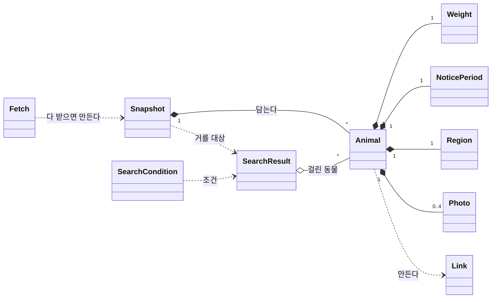
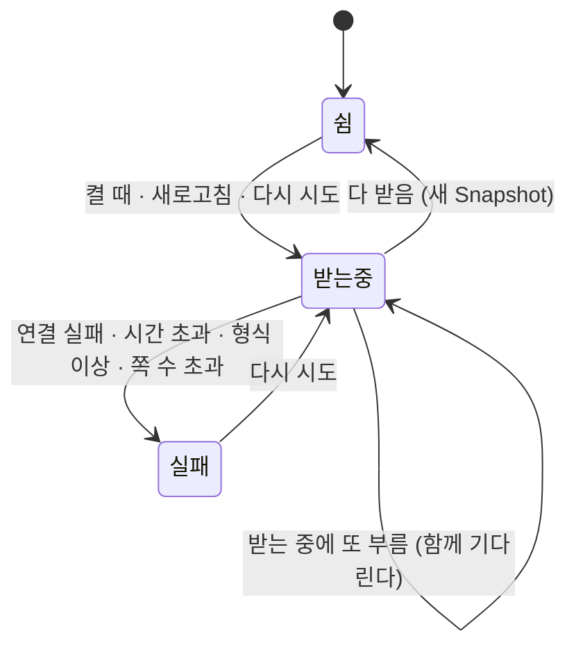

# 도메인 모델 — 포인핸드 대형묘 찾기

## 0. 이 문서가 다루는 것

앱이 다루는 개념, 개념 사이의 관계, 개념이 지키는 규칙을 정한다. 영문 개념 이름은 클래스 명세와 코드가 그대로 쓴다. 코드의 구조체·폴더는 클래스 명세가, 화면에 어떤 글자로 보일지는 UI 문서가 정한다.

데이터에 관한 사실은 2026-09-30에 받은 보호중 고양이 4,225건으로 확인한 것이다.

## 1. 개념 식별

유스케이스·요구에서 명사를 모아 추렸다. 규칙이 있거나 여러 값이 늘 함께 다니면 개념으로 남기고, 보여주기만 하는 값은 속성으로 내렸다.

| 후보 (나온 곳) | 판정 | 이유 |
|---|---|---|
| 고양이·아이·공고 ([[PAW-PRD-001#R1]] · [[PAW-UC-001#UC-H1]]) | 개념 `Animal` | 목록·상세·링크의 단위. 공고 한 건이 한 마리다 |
| 몸무게·원래 값·해석값 ([[PAW-PRD-001#R2]] · [[PAW-UC-001#UC-S2]]) | 개념 `Weight` | 해석 규칙이 있고 두 값이 늘 함께 다닌다 |
| 공고 기간·공고중/보호중 ([[PAW-PRD-001#R7]]) | 개념 `NoticePeriod` | 오늘 날짜로 상태가 정해지는 규칙이 있다 |
| 시·도·지역 미상 ([[PAW-PRD-001#R5]]) | 개념 `Region` | 거르기와 시·도별 마릿수의 단위. 빈 값 규칙이 있다 |
| 사진 ([[PAW-PRD-001#R8]] · [[PAW-INFRA-001#C10]]) | 개념 `Photo` | 주소를 정리하고 허용된 곳만 남기는 규칙이 있다 |
| 포인핸드 링크·원문 공고 ([[PAW-PRD-001#R9]] · [[PAW-UC-001#UC-S4]]) | 개념 `Link` | 주소를 만드는 규칙과 허용 목록이 있다 |
| 받아온 목록·받은 시각 ([[PAW-UC-001#UC-S1]] · [[PAW-UC-001#UC-H5]]) | 개념 `Snapshot` | 「다 받은 한 벌만 쓴다」는 규칙의 단위 |
| 받아오기·진행 상태·실패 이유 ([[PAW-PRD-001#R10]]) | 개념 `Fetch` | 한 번에 하나만 돌고, 진행·실패 상태를 가진다 |
| 조건 — 기준·기간·지역·정렬 ([[PAW-PRD-001#R3]] ~ [[PAW-PRD-001#R6]]) | 개념 `SearchCondition` | 기본값과 올바른 값의 규칙이 있다 |
| 걸린 목록·N마리·시·도별 마릿수 ([[PAW-UC-001#UC-S3]]) | 개념 `SearchResult` | 조회 한 번의 결과가 한 묶음으로 다닌다 |
| 공고번호·등록일·원문 번호 | `Animal` 속성 | 식별·거르기·링크에 쓰이는 값 |
| 보호소 이름·주소·전화, 관할 기관 이름·전화 | `Animal` 속성 | 보여주기만 하고 규칙이 없다 |
| 품종·색·나이·성별·중성화·특징·발견 장소 | `Animal` 속성 | 〃 |
| 설치 파일·버전·Release ([[PAW-PRD-001#R11]] · [[PAW-PRD-001#R12]]) | 경계 밖 | 인프라 문서가 다룬다(4장) |

## 2. 개념 모델

`Fetch`가 다 받으면 `Snapshot` 하나가 생기고, `Snapshot`에 `SearchCondition`을 대면 `SearchResult`가 나온다. `Animal`은 `Weight`·`NoticePeriod`·`Region`·`Photo`를 품고, 링크가 필요할 때 `Link`를 만든다.

## 3. 개념별 정리

#### Animal 보호 동물

공고 한 건, 곧 보호 중인 고양이 한 마리. 공고번호로 구별한다.

| 속성 | 뜻 | 받는 칸 | 비고 |
|---|---|---|---|
| 공고번호 | 식별자 | `notify_number` | 비면 그 건을 버린다([[PAW-UC-001#UC-S1]] 3a). 4,225건 중복 0 |
| 등록일 | 공고 등록일(연월일) | `registration_date` | 8자리 날짜. 기간 거르기·등록일 정렬의 기준. 못 읽으면 그 건을 버린다(2026-09-30 데이터에 1건 — 공고 종료일 `20251041`) |
| 몸무게 | `Weight` | `weight` | |
| 공고 기간 | `NoticePeriod` | `notify_sdt` · `notify_edt` | 둘 중 하나라도 못 읽으면 그 건을 버린다 |
| 지역 | `Region` | `city` · `country` | |
| 사진들 | `Photo` 0~4장 | `more_image1` · `image` · `image2` · `image3` | 순서는 `Photo` 참고 |
| 원문 번호 | 국가동물보호정보시스템 공고 번호. 없을 수 있다 | `detail_url` 안의 `desertion_no` | 숫자만 받는다. 4,225건 중 3,715건에 있다 |
| 품종 | 예: 한국고양이 | `s_breeds` | |
| 색 | | `color` | |
| 나이 | 받은 글자 그대로. 예: `2026(60일미만)(년생)` | `age` | 가공하지 않는다. 7건이 비어 있다 |
| 성별 | 수컷 · 암컷 · 미상 | `sex` = `M` · `F` · `Q` | 1,713 · 1,700 · 812건 |
| 중성화 | 했음 · 안 했음 · 미확인 | `neutral` = `Y` · `N` · `U` | 405 · 3,036 · 784건 |
| 특징 | | `feature` | |
| 발견 장소 | | `find_location` | |
| 보호소 이름·주소·전화 | | `shelter_name` · `shelter_address` · `shelter_tel` | 전화는 모두 있다 |
| 관할 기관 이름·전화 | | `office_name` · `office_tel` | 전화는 2,939건이 비어 있다 |

**공고번호 형식** — 네 가지가 있다: `서울-강동-2026-00167`(대부분), `경남-창원1-2026-00674`, `서울-시립2-2026-00080-P`, `광주-남구-2026-00054(구)`. 네 가지 모두 번호 전체를 주소용으로 인코딩하면 포인핸드 상세가 그 아이를 보여준다(2026-09-30 확인). 공고번호는 그대로 보관하고 링크를 만들 때만 인코딩한다.

**관계** — `Snapshot`에 담긴다. `SearchResult`가 가리킨다. `Link`를 만든다.

**판정 근거** — 목록·상세·링크가 모두 이 단위로 돈다. 공고번호가 유일하고 비어 있지 않다.

#### Weight 몸무게

| 속성 | 뜻 |
|---|---|
| 원래 값 | 받은 글자 그대로. 예: `9.00(Kg)`, `800(Kg)`, 빈 값 |
| kg | 해석한 값. 없을 수 있다(몸무게 없음) |

**규칙**
- 해석 순서는 [[PAW-PRD-001#R2]]가 정본이다([[PAW-UC-001#UC-S2]]). 원래 값은 바꾸지 않는다
- 기준과 비교할 때는 **이상**이다. 8.0kg은 기준 8kg에 걸린다
- 몸무게 없음은 어떤 기준에도 걸리지 않는다

**관계** — `Animal`이 하나 품는다.

**판정 근거** — 해석 규칙이 있고, 해석값과 원래 값을 늘 함께 보여줘야 한다([[PAW-PRD-001#R8]]).

#### NoticePeriod 공고 기간

| 속성 | 뜻 |
|---|---|
| 시작일 | 공고 시작일(8자리 날짜) |
| 종료일 | 공고 종료일(8자리 날짜) |
| 상태 (파생) | 공고중 · 보호중 |

**규칙** — 오늘이 종료일보다 뒤면 「보호중」, 아니면(종료일 당일 포함) 「공고중」. 포인핸드 사이트와 같은 비교다(`종료일 < 오늘`이면 공고가 끝난 것). 상태는 저장하지 않고 조회할 때마다 오늘 날짜로 정한다 — 앱을 켜 둔 채 날짜가 바뀌면 화면이 다시 조회해 맞춘다.

**관계** — `Animal`이 하나 품는다.

**판정 근거** — 날짜 둘로 상태가 정해지는 규칙이 있다([[PAW-PRD-001#R7]]).

#### Region 지역

| 속성 | 뜻 |
|---|---|
| 시·도 | 예: 경기도. 빈 값이면 「지역 미상」 |
| 시·군·구 | 예: 김제시. 모두 채워져 있다 |

**규칙**
- 시·도 선택지는 받아온 데이터에 실제로 있는 값으로 만든다. 행정구역 이름이 바뀌어도(`전남광주통합특별시`) 코드를 고치지 않게([[PAW-PRD-001#R5]])
- 시·도가 빈 아이(14건)는 「지역 미상」 한 묶음이다
- 제주·세종은 시·군·구 칸에도 시·도 이름이 온다. 보여줄 때 한 번만 쓰는 것은 화면의 일이다

**관계** — `Animal`이 하나 품는다. `SearchCondition`의 지역과 비교된다.

**판정 근거** — 거르기와 시·도별 마릿수의 단위이고, 빈 값 규칙이 있다.

#### Photo 사진

| 속성 | 뜻 |
|---|---|
| 주소 | 화면이 불러올 https 주소 |

**규칙** ([[PAW-INFRA-001#C10]])
- `http://`는 `https://`로 바꾼다
- `more/…` 같은 상대 경로는 `https://d12l2mexpetzlh.cloudfront.net/images/shelter/`를 앞에 붙인다
- 바꾼 뒤 `https://www.animal.go.kr/` 또는 `https://d12l2mexpetzlh.cloudfront.net/`로 시작하지 않으면 버린다
- 순서는 `more_image1` → `image` → `image2` → `image3`. 포인핸드 사이트도 `more_image1`이 있으면 대표 사진으로 쓴다. 빈 칸과 같은 주소는 뺀다
- 화면은 앞에서부터 최대 3장을 쓴다([[PAW-PRD-001#R8]]). 첫 장이 카드의 대표 사진이다

데이터: `image` 4,225건(전부), `image2` 3,169건, `image3` 432건, `more_image1` 25건.

**관계** — `Animal`이 0~4장 품는다.

**판정 근거** — 받은 주소를 그대로 쓰지 않는 정리 규칙과 허용 목록이 있다.

#### Link 공고 링크

| 속성 | 뜻 |
|---|---|
| 종류 | 포인핸드 · 원문 |
| 주소 | 기본 브라우저로 열 https 주소 |

**규칙** ([[PAW-UC-001#UC-S4]] · [[PAW-INFRA-001#C9]])
- 포인핸드: `https://pawinhand.kr/shelter/animal/detail/{공고번호}` — 공고번호 전체를 주소용으로 인코딩
- 원문: `https://www.animal.go.kr/front/awtis/public/publicDtl.do?desertionNo={원문 번호}`. 원문 번호가 없으면 원문 링크가 없다
- 받아온 `detail_url`을 그대로 쓰지 않는다
- 만든 주소가 `https://pawinhand.kr/` 또는 `https://www.animal.go.kr/`로 시작하지 않으면 열지 않는다

**관계** — `Animal`이 필요할 때 만든다. 포인핸드 링크는 늘 1개, 원문 링크는 0~1개.

**판정 근거** — 주소를 만드는 규칙과 허용 목록이 있고, 받은 값을 그대로 믿지 않는다.

#### Snapshot 받아온 목록

| 속성 | 뜻 |
|---|---|
| 동물들 | `Animal` 목록. 공고번호로 유일 |
| 받은 시각 | 받아오기가 끝난 시각 |

**규칙**
- **다 받은 것만 `Snapshot`이 된다.** 몇 쪽 받다가 실패한 일부는 `Snapshot`이 되지 않는다([[PAW-UC-001#UC-H1]] 2b)
- **한 마리도 없는 목록은 `Snapshot`이 되지 않는다.** 보호중 고양이가 전국에 한 마리도 없을 수는 없으니 받기가 잘못된 것이다(형식 이상, [[PAW-UC-001#UC-S1]] 6a) — 빈 목록이 좋은 목록을 지우지 않게
- 앱에 하나만 있다. 새 `Snapshot`이 생기면 통째로 바뀌고, 받아오기가 실패하면 이전 것이 그대로 남는다([[PAW-UC-001#UC-H5]] 3a)
- 거르기는 `Snapshot`을 바꾸지 않는다([[PAW-UC-001#UC-S3]] 최소 보장)
- 앱을 끄면 사라진다. 저장하지 않는다([[PAW-INFRA-001#C1]])

**관계** — `Fetch`가 만든다. `Animal`을 담는다. `SearchResult`의 거를 대상이다.

**판정 근거** — 「불완전한 목록을 완전한 것처럼 보이지 않는다」는 규칙이 이 단위에 걸린다.

#### Fetch 받아오기

| 속성 | 뜻 |
|---|---|
| 상태 | 쉼 · 받는 중 · 실패 |
| 받은 건수 | 받는 중 지금까지 받은 줄 수(진행 상태). 겹쳐 받은 줄은 한 번만 센다 |
| 실패 이유 | 연결 실패 · 시간 초과(한 요청 15초) · 형식 이상(오류 응답, JSON 배열 아님, 한 건도 옮기지 못함) · 쪽 수 초과(20쪽) |

**규칙** ([[PAW-UC-001#UC-S1]])
- 한 번에 하나만 돈다. 받는 중에 또 부르면 새로 시작하지 않고 그 받기가 끝나기를 기다려 같은 결과를 받는다([[PAW-UC-001#UC-S1]] 1a · [[PAW-UC-001#UC-H5]] 1a)
- 한 쪽에 1000건, 앞 요청이 끝나고 0.3초 뒤에 다음 쪽. 1000건보다 적게 오면 끝
- 다음 쪽은 앞 쪽과 50건을 겹쳐 받는다 — 받는 사이 앞쪽에서 빠진 아이가 있어 줄이 당겨져도 뒤 아이를 놓치지 않게. 겹쳐 받은 아이는 `Snapshot`에 한 번만 남는다
- 다 받았는데 한 마리도 옮기지 못했으면 형식 이상으로 실패한다
- 다 받으면 새 `Snapshot`을 만들고, 실패하면 `Snapshot`에 손대지 않는다

**관계** — `Snapshot`을 만든다.

**판정 근거** — 진행·실패 상태와 「한 번에 하나」 규칙을 가진다([[PAW-PRD-001#R10]] · [[PAW-PRD-001#N2]]).

#### SearchCondition 조건

| 속성 | 값 | 기본값 |
|---|---|---|
| 몸무게 기준 | 0 이상 kg, 0.1 단위 | 8 |
| 기간 | 전체 · 최근 1년 · 최근 6개월 · 최근 3개월 | 전체 |
| 지역 | 전국 · 시·도 하나 · 지역 미상 | 전국 |
| 정렬 | 무거운 순 · 등록일 최신순 | 무거운 순 |

**규칙**
- 기준이 숫자가 아니거나 0보다 작으면 받지 않는다. 마지막으로 올바르던 조건을 쓴다([[PAW-UC-001#UC-H2]] 4a)
- 새로고침 뒤 고른 시·도나 「지역 미상」이 새 데이터에 없으면 지역을 전국으로 돌린다([[PAW-UC-001#UC-H5]] 4a)
- 앱을 다시 켜면 기본값이다([[PAW-INFRA-001#C1]])

**관계** — `SearchResult`를 만들 때 쓰인다.

**판정 근거** — 기본값과 올바른 값의 규칙이 있다([[PAW-PRD-001#R3]] ~ [[PAW-PRD-001#R6]]).

#### SearchResult 조회 결과

| 속성 | 뜻 |
|---|---|
| 걸린 동물들 | 조건에 맞는 `Animal`, 정렬된 순서 |
| 마릿수 | 걸린 동물 수 |
| 시·도별 마릿수 | 지역 조건만 빼고 나머지 조건으로 센 수. 지역 선택지 옆에 붙는다 |

**규칙** ([[PAW-UC-001#UC-S3]])
- 거르는 순서: 몸무게 없음 빼고 기준 이상 → 기간(등록일이 오늘로부터 그 기간 안) → 지역
- 정렬: 무거운 순이면 kg 내림차순, 같으면 등록일 최신순. 등록일 최신순이면 등록일 내림차순, 같으면 무거운 순
- 조건이 바뀔 때마다 새로 만든다. 다시 받아오지 않는다
- 0마리일 수 있다. 그때 화면은 안내 문구와 지금 조건을 보여준다([[PAW-PRD-001#R7]])

**관계** — 한 `Snapshot`과 한 `SearchCondition`에서 나온다. `Animal`을 가리킨다(복사하지 않는다).

**판정 근거** — 목록·마릿수·시·도별 마릿수가 조회 한 번에 함께 만들어지고 함께 쓰인다.

## 4. 경계

**이 모델이 다루지 않는 것**

| 다루지 않는 것 | 어디서 | 이유 |
|---|---|---|
| 포인핸드 API의 칸 이름·형식 | 받아오기 한 곳에서 개념으로 옮긴다 | 개념은 API 칸 이름을 모른다. 포인핸드가 형식을 바꾸면 옮기는 곳만 고친다([[PAW-INFRA-001#C6]]) |
| 버리는 칸 | — | `idx`(늘 0), `animal_name`(늘 비어 있음), `species`(늘 고양이), `state`(늘 보호중 — 그렇게 요청했다), 조회·좋아요·댓글·공유 수, 추천 관련 칸, `w_date`, `shelterAnimalInfo`, `more_info_idx`. 요구에 쓰이지 않는다 |
| 설치·배포 — 버전, Release, 설치 파일 | [[PAW-INFRA-001]] | 앱이 다루는 대상이 아니라 앱을 나르는 방법이다 |
| 화면 상태 — 스크롤 위치, 열린 상세, 입력 중인 값 | UI 문서 | 개념의 규칙이 아니라 화면의 일이다 |
| 저장 | — | 모든 개념이 앱이 켜져 있는 동안만 산다([[PAW-INFRA-001#C1]]). 그래서 ERD는 최소가 된다 |
| 입양 신청·문의 | 포인핸드·보호소 | PRD 비목표 |

**도메인은 하나다 — `animal`.** 개념 10개가 모두 「받아온 보호 동물 목록」 하나를 두고 돈다. 받아오기(`Fetch`·`Snapshot`)와 조회(`SearchCondition`·`SearchResult`)로 나누면 `Snapshot`을 두 도메인이 함께 쥐게 되고, 나눠서 얻는 것이 없다. 클래스 명세는 이 하나를 코드 폴더 하나로 옮긴다.

## 5. 미결사항

- [x] 사용자가 정할 것은 없다. 나이·성별·중성화를 화면에 어떤 글자로 보일지는 UI 문서에서 정한다
