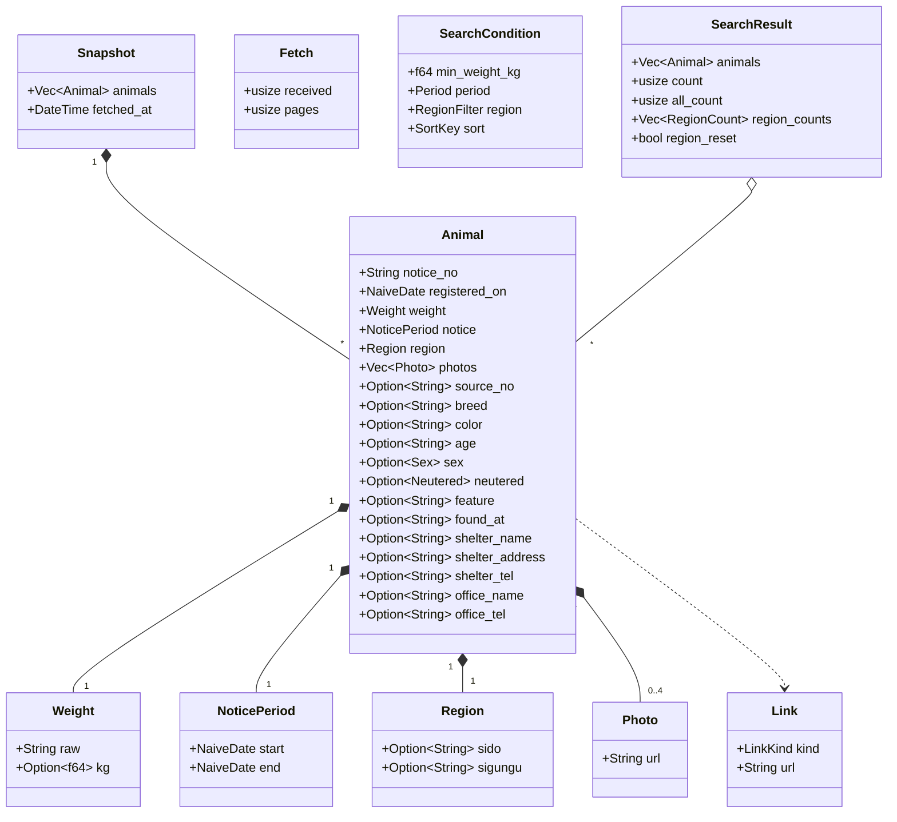
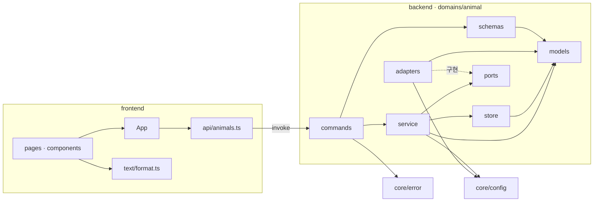
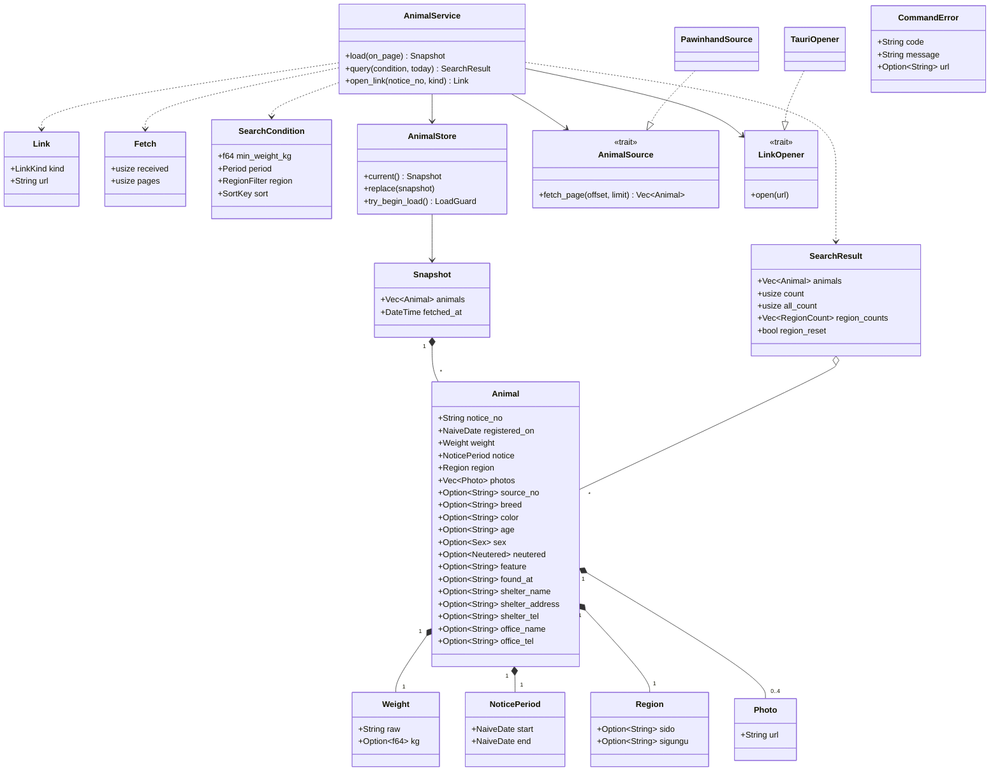

# 클래스 명세 — 포인핸드 대형묘 찾기

## 0. 이 문서가 다루는 것

코드의 폴더, 구조체·트레이트·모듈, 그리고 누가 누구를 부르는지를 정한다. 개념과 규칙은 [[PAW-DOM-001]]이, 커맨드의 입출력 모양은 [[PAW-API-001]]이, 화면은 [[PAW-UI-001]]이 정한 것을 코드 이름으로 옮긴다.

- 코어는 Rust, 화면은 React + TypeScript다([[PAW-INFRA-001]] 3장)
- **저장하는 것이 없다**([[PAW-INFRA-001#C1]]). 그래서 엔티티에 테이블이 없고, 2장의 엔티티 줄에는 도메인 링크만 단다
- 도메인은 `animal` 하나다([[PAW-DOM-001]] 4장)

## 1. 폴더 구조

```
fourinhand-crawl/
├── backend/                     코어 — Rust 크레이트와 Tauri 설정
│   ├── Cargo.toml · Cargo.lock
│   ├── build.rs                 tauri_build
│   ├── tauri.conf.json          앱 이름·식별자·버전·창·설치 파일·CSP (무엇을 읽는지는 INFRA)
│   ├── capabilities/
│   │   └── default.json         화면에 여는 권한: 앱 커맨드 셋만
│   ├── icons/                   앱 아이콘(포인핸드 로고 아님)
│   └── src/
│       ├── main.rs              앱 조립: 상태 만들기, 플러그인·커맨드 등록
│       ├── core/
│       │   ├── config.rs        상수: 포인핸드 주소, 쪽 크기, 간격, 시간 제한, 쪽 상한, User-Agent
│       │   └── error.rs         CommandError — 화면에 가는 오류 모양과 코드
│       └── domains/
│           └── animal/
│               ├── commands.rs  Tauri 커맨드 셋 — 입출력만 (router 역할)
│               ├── schemas.rs   화면과 주고받는 모양, camelCase
│               ├── service.rs   받아오기·조회·링크 열기의 흐름과 거르기 규칙
│               ├── store.rs     받아온 목록 보관과 「받는 중」 표시 (crud 역할)
│               ├── models.rs    개념 구조체와 자기 값을 만드는 규칙
│               ├── ports.rs     밖과 닿는 두 곳의 트레이트: AnimalSource, LinkOpener
│               └── adapters/
│                   ├── pawinhand.rs   포인핸드 API 호출과 응답 칸 → 개념 옮기기
│                   └── opener.rs      tauri-plugin-opener로 기본 브라우저 열기
├── frontend/                    화면 — React + TypeScript + Vite. 빌드 결과는 frontend/dist, 코어가 그것을 앱에 담는다
│   ├── index.html
│   ├── package.json · package-lock.json · tsconfig.json · vite.config.ts
│   └── src/
│       ├── main.tsx             진입: 글꼴·styles.css를 불러오고 App을 그린다
│       ├── App.tsx              화면 상태의 주인. 라우팅 없음 — 화면 주소가 하나다
│       ├── pages/
│       │   ├── ListPage.tsx     UI-1
│       │   ├── DetailPanel.tsx  UI-2
│       │   └── AboutDialog.tsx  UI-3
│       ├── components/          두 화면 이상이 쓰는 조각
│       │   ├── WeightTag.tsx    무게표 (UI-1 카드, UI-2)
│       │   ├── StatusBadge.tsx  보호중·공고중 배지 (UI-1, UI-2)
│       │   └── PhotoBox.tsx     사진, 못 불러오면 빈 그림 (UI-1, UI-2)
│       ├── api/
│       │   └── animals.ts       invoke 셋과 타입 — API 문서의 전사
│       ├── text/
│       │   └── format.ts        화면 글 만들기: 무게·나이·성별·날짜·받침·실패 문구
│       ├── assets/fonts/        SUIT-Variable.woff2
│       └── styles.css           UI 문서 3장 토큰의 전사
├── scripts/
│   ├── dev.ps1                  개발 실행
│   └── build.ps1                설치 파일 만들기
├── docs/specs/                  명세 원본
├── .github/workflows/
│   └── release.yml              태그를 올리면 빌드해 Release에 올린다
├── .gitignore                   target/ · node_modules/ · dist/
├── README.md                    설치 안내(PC 보호 경고 넘기기), 비공식 앱 안내
└── AGENTS.md                    에이전트용: 명세가 먼저, 싱크독 규약
```

**기본형(규약 1.9)과 다른 곳과 그 이유**

| 다른 곳 | 이유 |
|---|---|
| `app/` 대신 `backend/src/`, `main.py` 대신 `main.rs` | Rust 크레이트의 모양이다. 역할(앱 조립)은 같다. Tauri 틀의 `lib.rs`는 모바일용이라 두지 않는다 |
| `router.py` 대신 `commands.rs` | Tauri에서 입구는 HTTP 경로가 아니라 커맨드다. 입출력만 한다는 역할은 같다. 입구가 화면 하나라 도메인 안에 둔다 |
| `crud.py` 대신 `store.rs` | DB가 없다. 받아온 목록을 메모리에 두고 바꾸는 일이 crud의 자리다 |
| `models.py`에 규칙까지 | ORM이 없어 models는 도메인 개념 자체다. 몸무게 해석·사진 주소 정리·링크 만들기처럼 **자기 값을 만드는 규칙**은 그 구조체에 둔다 — 여러 곳에 흩어지지 않게. 여러 개념을 엮는 흐름과 거르기는 `service.rs`다 |
| `ports.rs`·`adapters/`를 둔다 | 조건부 자리인데 조건이 맞는다: 포인핸드 API와 기본 브라우저, 밖과 닿는 곳이 둘이다. 그리고 두 트레이트 모두 **테스트의 가짜 구현이 실제 두 번째 사용처**다 — 네트워크·브라우저 없이 쪽 넘기기, 중간 실패, 링크 열기 실패를 검증한다 |
| `infra/`·`shared/`가 없다 | 밖과 닿는 클라이언트는 포인핸드 하나라 어댑터 안에 둔다. 도메인이 하나라 여러 도메인이 함께 쓸 유틸이 없다 |
| `tests/` 거울 폴더가 없다 | Rust는 단위 테스트를 같은 파일의 `#[cfg(test)]` 모듈에 둔다. 실데이터 점검([[PAW-INFRA-001]] 7장)도 `adapters/pawinhand.rs`의 `#[ignore]` 테스트다 |
| `frontend/src/text/` | 기본형에 없는 폴더. 두 화면이 같은 글 규칙(UI 문서의 「보여주는 글」)을 쓰는데, 컴포넌트가 아니라 순수 함수라 `components/`에 두지 않는다 |
| `pages/`에 패널·대화상자 | UI-2·UI-3도 와이어프레임 항목이다. 화면 하나 = 파일 하나를 지킨다 |
| `scripts/` | Tauri CLI는 `frontend/`의 package.json에 있고, 코어 폴더는 `TAURI_APP_PATH=backend`로 알려 준다(Tauri CLI 소스 `app_paths.rs`로 확인: 이 변수가 없으면 현재 폴더에서 3단계 아래까지만 찾는다). 이 변수를 매번 치지 않게 스크립트로 묶는다 |
| `Dockerfile`·`.env.example`이 없다 | 서버에 배치하지 않는다. 비밀값이 없다([[PAW-INFRA-001]] 5장) |

## 2. 엔티티

도메인 모델의 개념을 옮긴 구조체다. 모두 `domains/animal/models.rs`에 있다. 날짜는 `chrono::NaiveDate`, 시각은 `chrono::DateTime<FixedOffset>`.



#### Animal 보호 동물

도메인: [[PAW-DOM-001#Animal]]

- `notice_no` — 공고번호. 식별자. 받은 글자 그대로 두고, 링크를 만들 때만 인코딩한다
- `registered_on` — 등록일. 기간 거르기와 등록일 정렬의 기준
- `weight` · `notice` · `region` · `photos` — 각 개념 구조체
- `source_no` — 국가동물보호정보시스템 원문 번호. `detail_url`의 `desertion_no`에서 숫자일 때만 꺼낸다. 없으면 원문 링크가 없다([[PAW-DOM-001#Link]])
- 나머지 — 보여주기만 하는 값. 빈 값과 공백뿐인 값은 `None`, 앞뒤 공백은 지운다([[PAW-API-001]] 1장)
- `Sex`는 `M`·`F`·`Q`, `Neutered`는 `Y`·`N`·`U` 열거형. 그 밖의 값은 `None`
- 스냅숏 안에서는 `Arc<Animal>`로 들고 다닌다 — 조회 결과가 복사하지 않고 가리키게([[PAW-DOM-001#SearchResult]])

#### Weight 몸무게

도메인: [[PAW-DOM-001#Weight]]

- `raw` — 받은 글자 그대로. 바꾸지 않는다
- `kg` — 해석값. 숫자로 바뀌지 않으면 `None`
- `Weight::parse(raw) -> Weight` — [[PAW-PRD-001#R2]]의 여섯 단계를 순서대로. 규칙이 한 곳에만 있게 이 함수 하나로 만든다
- `Weight::at_least(&self, min) -> bool` — `kg`가 있고 `kg >= min`일 때만 참

#### NoticePeriod 공고 기간

도메인: [[PAW-DOM-001#NoticePeriod]]

- `start` · `end` — 공고 시작일·종료일
- `status(&self, today) -> NoticeStatus` — `today > end`면 `Protected`(보호중), 아니면 `Notice`(공고중). 저장하지 않고 부를 때마다 계산한다

#### Region 지역

도메인: [[PAW-DOM-001#Region]]

- `sido` — 시·도. `None`이면 「지역 미상」
- `sigungu` — 시·군·구
- `matches(&self, filter: &RegionFilter) -> bool` — 전국·시·도·지역 미상 비교

#### Photo 사진

도메인: [[PAW-DOM-001#Photo]]

- `url` — 화면이 불러올 https 주소
- `Photo::from_raw(raw) -> Option<Photo>` — `http://`는 `https://`로, 주소가 아닌 `more/…`는 포인핸드 CDN `https://d12l2mexpetzlh.cloudfront.net/images/shelter/`를 앞에 붙인다. 두 허용 호스트가 아니면 `None`([[PAW-INFRA-001#C10]])
- 순서는 `more_image1` → `image` → `image2` → `image3`, 같은 주소는 뺀다. 순서를 맞추는 일은 어댑터가 한다

#### Link 공고 링크

도메인: [[PAW-DOM-001#Link]]

- `kind` — `LinkKind::Pawinhand` · `LinkKind::Source`
- `url` — 기본 브라우저로 열 주소
- `Link::for_animal(animal, kind) -> Result<Link, LinkError>` — 포인핸드는 `https://pawinhand.kr/shelter/animal/detail/` + 공고번호(RFC 3986의 예약되지 않은 글자 `A-Z a-z 0-9 - _ . ~` 말고 모두 인코딩 — 괄호도), 원문은 `https://www.animal.go.kr/front/awtis/public/publicDtl.do?desertionNo=` + `source_no`. 원문 번호가 없으면 `LinkError::NoSource`, 만든 주소가 두 허용 접두로 시작하지 않으면 `LinkError::NotAllowed`

#### Snapshot 받아온 목록

도메인: [[PAW-DOM-001#Snapshot]]

- `animals` — `Vec<Arc<Animal>>`. 공고번호로 유일
- `fetched_at` — 다 받은 시각(현지 시간대)
- `Snapshot::new(animals, fetched_at)` — 공고번호 중복을 뺀다. 다 받은 뒤에만 부른다
- `find(&self, notice_no) -> Option<&Arc<Animal>>`

#### Fetch 받아오기

도메인: [[PAW-DOM-001#Fetch]]

받아오기 한 번의 진행 기록이다. 요청과 기다리기는 서비스가 하고, 쪽을 셀 때의 규칙만 여기 있다.

- `received` — 지금까지 받은 마릿수. 화면의 진행 상태
- `pages` — 받은 쪽 수
- `record_page(&mut self, n) -> Result<bool, FetchError>` — 한 쪽을 셌다. 쪽 수가 `MAX_PAGES`(20)를 넘으면 `FetchError::TooManyPages`. 돌려주는 참·거짓은 「더 받을지」(`n == PAGE_SIZE`)
- 「한 번에 하나」는 `AnimalStore`가 지킨다(4장)

#### SearchCondition 조건

도메인: [[PAW-DOM-001#SearchCondition]]

- `min_weight_kg` — 기준 kg
- `period` — `Period::{All, OneYear, SixMonths, ThreeMonths}`
- `region` — `RegionFilter::{All, Sido(String), Unknown}`
- `sort` — `SortKey::{Weight, Registered}`
- `validate(&self) -> Result<(), ConditionError>` — 기준이 유한한 수이고 0 이상인지, `Sido`의 이름이 비지 않았는지
- `since(&self, today) -> Option<NaiveDate>` — 기간의 첫날. `chrono`의 `checked_sub_months`로 12·6·3개월을 빼고, 없는 날은 그 달 말일이 된다. `All`이면 `None`

#### SearchResult 조회 결과

도메인: [[PAW-DOM-001#SearchResult]]

- `animals` — 걸린 동물 `Vec<Arc<Animal>>`, 정렬된 순서
- `count` — 걸린 수
- `all_count` — 지역 조건만 뺀 나머지 조건에 걸린 수
- `region_counts` — `Vec<RegionCount>`. 스냅숏에 있는 시·도마다 하나(0 포함), 지역 미상이 있으면 하나 더
- `region_reset` — 고른 시·도가 스냅숏에 아예 없어 전국으로 걸렀는지

## 3. 의존 관계

부르는 방향은 한 방향이다. 코어는 `commands → service → store`, 밖과 닿는 곳은 `service → ports`이고 어댑터가 포트를 채운다. `models`는 모두가 쓰지만 아무것도 부르지 않는다.



| 규칙 | 뜻 |
|---|---|
| 화면은 `api/`로만 코어를 부른다 | 커맨드 이름과 응답 모양이 한 파일에만 있다(규약 1.9) |
| `commands`는 판단하지 않는다 | 인자를 모델로 바꾸고, 오늘 날짜를 읽고, 서비스를 부르고, 결과를 `schemas`로 바꿀 뿐이다 |
| `service`는 Tauri를 모른다 | `AppHandle`·`Channel`을 받지 않는다. 진행 상태는 클로저로 받는다 — 그래서 Tauri 없이 테스트된다 |
| 어댑터만 바깥 형식을 안다 | 포인핸드의 칸 이름(`notify_number` 같은 것)은 `adapters/pawinhand.rs` 밖에 나오지 않는다([[PAW-DOM-001]] 4장) |
| `models`는 순수하다 | 네트워크·시계·전역 상태를 쓰지 않는다. 오늘 날짜도 인자로 받는다 |

## 4. 설계 클래스



#### AnimalService 동물 서비스

`domains/animal/service.rs`. 제네릭 `AnimalService<S: AnimalSource, O: LinkOpener>` — 앱에서는 `AnimalService<PawinhandSource, TauriOpener>`, 테스트에서는 가짜 구현을 넣는다. Tauri 상태로 하나만 둔다.

| 메서드 | 부르는 곳 | 유스케이스 | 던지는 에러 |
|---|---|---|---|
| `async load(&self, on_page: impl Fn(usize)) -> Result<Arc<Snapshot>, FetchError>` | `load_animals` | [[PAW-UC-001#UC-S1]] · [[PAW-UC-001#UC-H1]] · [[PAW-UC-001#UC-H5]] | `Busy` · `ConnectionFailed` · `Timeout` · `BadFormat` · `TooManyPages` |
| `query(&self, condition, today) -> Result<SearchResult, QueryError>` | `query_animals` | [[PAW-UC-001#UC-S3]] · [[PAW-UC-001#UC-H2]] | `NoSnapshot` · `InvalidCondition` |
| `open_link(&self, notice_no, kind) -> Result<Link, OpenLinkError>` | `open_link` | [[PAW-UC-001#UC-S4]] · [[PAW-UC-001#UC-H4]] | `NoSnapshot` · `NotFound` · `NoSource` · `NotAllowed` · `OpenFailed(url)` |

규칙
- `load`: `store.try_begin_load()`가 없으면 `Busy`. 쪽마다 `source.fetch_page` → `fetch.record_page` → `on_page(received)` → 더 받을 때만 `PAGE_GAP`(0.3초) 기다림. 다 받으면 `Snapshot::new` 후 `store.replace`. 실패하면 받은 것을 버리고 `store`는 건드리지 않는다([[PAW-UC-001#UC-H1]] 2b · [[PAW-UC-001#UC-H5]] 3a). 끝나면 성공·실패와 관계없이 「받는 중」을 푼다(가드가 떨어질 때)
- `query`: `condition.validate()` → 스냅숏을 `Arc`로 받아 거른다. 순서는 몸무게(`Weight::at_least`) → 기간(`registered_on >= since`) → 지역. 지역 조건만 뺀 결과로 `all_count`와 `region_counts`를 센다. 고른 시·도가 스냅숏에 아예 없으면 지역을 `All`로 바꿔 거르고 `region_reset = true`. 정렬은 [[PAW-API-001]]의 `query_animals`대로(무게 → 등록일 → 공고번호)
- `open_link`: `store.current()` → `find` → `Link::for_animal` → `opener.open(url)`. 여는 데 실패하면 만든 주소를 담아 돌려준다

#### AnimalStore 보관소

`domains/animal/store.rs`. 받아온 목록 하나와 「받는 중」 표시만 든다.

| 메서드 | 부르는 곳 | 유스케이스 | 던지는 에러 |
|---|---|---|---|
| `current(&self) -> Option<Arc<Snapshot>>` | `AnimalService::query` · `open_link` | [[PAW-UC-001#UC-S3]] · [[PAW-UC-001#UC-S4]] | — |
| `replace(&self, snapshot: Snapshot)` | `AnimalService::load` | [[PAW-UC-001#UC-S1]] | — |
| `try_begin_load(&self) -> Option<LoadGuard>` | `AnimalService::load` | [[PAW-UC-001#UC-H5]] 1a | — (없으면 호출자가 `Busy`) |

규칙 — 스냅숏은 `RwLock<Option<Arc<Snapshot>>>`, 「받는 중」은 `AtomicBool`. 바꿀 때는 `Arc`를 통째로 갈아 끼워, 읽는 쪽이 반쯤 바뀐 목록을 보지 않게 한다. `LoadGuard`가 떨어지면 「받는 중」이 풀린다 — 패닉이나 조기 반환에도 풀리게

#### AnimalSource 동물 원천

`domains/animal/ports.rs`의 트레이트. 앱에서는 `PawinhandSource`가, 테스트에서는 미리 정한 쪽들을 돌려주는 가짜가 구현한다.

| 메서드 | 부르는 곳 | 유스케이스 | 던지는 에러 |
|---|---|---|---|
| `fetch_page(&self, offset, limit) -> impl Future<Output = Result<Vec<Animal>, FetchError>> + Send` | `AnimalService::load` | [[PAW-UC-001#UC-S1]] | `ConnectionFailed` · `Timeout` · `BadFormat` |

규칙 — 돌려주는 것은 이미 개념으로 옮긴 `Animal`이다. 공고번호가 없는 건은 여기서 버린다([[PAW-UC-001#UC-S1]] 3a)

#### PawinhandSource 포인핸드 어댑터

`domains/animal/adapters/pawinhand.rs`. `reqwest::Client` 하나를 들고 있다.

| 메서드 | 부르는 곳 | 유스케이스 | 던지는 에러 |
|---|---|---|---|
| `new(user_agent) -> Self` | `main.rs` | — | — |
| `fetch_page(offset, limit)` | `AnimalService::load` | [[PAW-UC-001#UC-S1]] | `ConnectionFailed` · `Timeout` · `BadFormat` |

규칙
- 요청 조건과 주소는 `core/config.rs`의 상수에서 온다. 쿼리는 폼 인코딩(공백 → `+`)이고, 인코딩 결과를 단위 테스트로 고정한다([[PAW-INFRA-001#C8]])
- 시간 제한 15초, User-Agent `PawinhandBigCat/{버전} (+저장소 주소)`([[PAW-INFRA-001#C7]]). 버전은 Tauri 설정의 버전을 앱이 읽어 넘긴다
- 응답은 먼저 `Vec<RawAnimal>`(포인핸드 칸 이름 그대로의 serde 구조체)로 읽는다. 배열이 아니면 `BadFormat`. `RawAnimal → Animal` 옮기기가 이 파일의 핵심이다: 날짜 8자리 → `NaiveDate`(못 읽으면 그 건을 버린다), `Weight::parse`, `Photo::from_raw`, `desertion_no` 꺼내기, 빈 값 `None`
- 테스트: 쿼리 인코딩, 실제 응답 한 건을 담은 JSON으로 옮기기 검증, 그리고 `#[ignore]` 실데이터 점검(실제 API로 한 번 받기, 원문 주소 하나를 열어 공고번호 확인, 사진 하나 열기 — [[PAW-INFRA-001]] 7장)

#### LinkOpener 링크 열개

`domains/animal/ports.rs`의 트레이트. 앱에서는 `TauriOpener`가, 테스트에서는 연 주소를 적어 두거나 일부러 실패하는 가짜가 구현한다.

| 메서드 | 부르는 곳 | 유스케이스 | 던지는 에러 |
|---|---|---|---|
| `open(&self, url: &str) -> Result<(), OpenError>` | `AnimalService::open_link` | [[PAW-UC-001#UC-S4]] | `OpenError` |

#### TauriOpener 브라우저 어댑터

`domains/animal/adapters/opener.rs`. `AppHandle`을 들고 `tauri_plugin_opener::OpenerExt::opener().open_url(url, None)`을 부른다. 화면에는 opener 권한을 주지 않는다 — 여는 것은 코어뿐이다([[PAW-INFRA-001]] 5장).

#### CommandError 커맨드 오류

`core/error.rs`. 화면에 가는 오류 모양 `{ code, message, url? }`([[PAW-API-001]] 1장).

| 메서드 | 부르는 곳 | 유스케이스 | 던지는 에러 |
|---|---|---|---|
| `From<FetchError>` · `From<QueryError>` · `From<OpenLinkError>` | `commands.rs` | — | — |

규칙 — 도메인 오류 열거형의 값 하나가 코드 하나다: `Busy`→`busy`, `ConnectionFailed`→`connection-failed`, `Timeout`→`timeout`, `BadFormat`→`bad-format`, `TooManyPages`→`too-many-pages`, `NoSnapshot`→`no-snapshot`, `InvalidCondition`→`invalid-condition`, `NotFound`→`not-found`, `NoSource`→`no-source`, `NotAllowed`→`not-allowed`, `OpenFailed`→`open-failed`(`url` 함께). 코드 목록이 이 한 곳에만 있다

#### AnimalCommands 커맨드

`domains/animal/commands.rs`의 `#[tauri::command]` 함수 셋. 이름과 인자는 [[PAW-API-001]] 그대로다.

| 메서드 | 부르는 곳 | 유스케이스 | 던지는 에러 |
|---|---|---|---|
| `async load_animals(state, on_progress: Channel<FetchProgressDto>) -> Result<LoadResultDto, CommandError>` | 화면 `api/animals.ts` | [[PAW-UC-001#UC-H1]] · [[PAW-UC-001#UC-H5]] | [[PAW-API-001]] 1장 표 |
| `query_animals(state, condition: ConditionDto) -> Result<QueryResultDto, CommandError>` | 화면 `api/animals.ts` | [[PAW-UC-001#UC-H2]] | 〃 |
| `open_link(state, notice_no: String, kind: LinkKindDto) -> Result<OpenLinkResultDto, CommandError>` | 화면 `api/animals.ts` | [[PAW-UC-001#UC-H4]] | 〃 |

규칙 — 오늘 날짜(`chrono::Local::now().date_naive()`)는 여기서 읽어 서비스에 넘긴다. `schemas.rs`의 DTO는 모두 `#[serde(rename_all = "camelCase")]`이고, `AnimalDto::from_model(&Animal, today)`가 `notice.status`를 오늘로 계산해 채운다

#### AnimalsApi 화면 쪽 호출

`frontend/src/api/animals.ts`. `invoke`를 부르는 유일한 파일이다.

| 메서드 | 부르는 곳 | 유스케이스 | 던지는 에러 |
|---|---|---|---|
| `loadAnimals(onProgress: (received: number) => void): Promise<LoadResult>` | `App` | [[PAW-UC-001#UC-H1]] · [[PAW-UC-001#UC-H5]] | `ApiError` |
| `queryAnimals(condition: Condition): Promise<QueryResult>` | `App` | [[PAW-UC-001#UC-H2]] | `ApiError` |
| `openLink(noticeNo: string, kind: 'pawinhand' \| 'source'): Promise<{ url: string }>` | `ListPage` · `DetailPanel`를 거쳐 `App` | [[PAW-UC-001#UC-H4]] | `ApiError` |

규칙 — 타입(`Condition`, `QueryResult`, `AnimalView`, `ApiError` 등)은 [[PAW-API-001]]의 JSON을 그대로 옮긴다. 진행 상태는 `@tauri-apps/api/core`의 `Channel`로 받는다

#### App 화면 상태

`frontend/src/App.tsx`. 화면 상태를 한 곳에 둔다 — 받아오기 단계(`loading`·`failed`·`ready`), 받은 시각·마릿수, 조건, 조회 결과, 새로고침 실패, 열린 상세(공고번호와 처음 보일 링크 실패), 앱 정보 열림.

| 메서드 | 부르는 곳 | 유스케이스 | 던지는 에러 |
|---|---|---|---|
| `refresh()` | 켤 때, 1.3 새로고침, 다시 시도 | [[PAW-UC-001#UC-H1]] · [[PAW-UC-001#UC-H5]] | — |
| `changeCondition(next)` | `ListPage` | [[PAW-UC-001#UC-H2]] | — |
| `openLink(noticeNo, kind, from)` | `ListPage` · `DetailPanel` | [[PAW-UC-001#UC-H4]] | — |

규칙
- 차례는 [[PAW-API-001]] 3장을 따른다. 조회는 부를 때마다 번호를 매기고, 가장 마지막 번호의 결과만 그린다
- 숫자 칸 입력은 멈추고 150ms 뒤에만 `changeCondition`을 부른다
- 카드의 링크가 `open-failed`·`not-allowed`로 실패하면 그 아이의 `DetailPanel`을 실패 상태로 연다([[PAW-UI-001#UI-1]] 규칙)

#### ListPage 목록 화면

`frontend/src/pages/ListPage.tsx` — [[PAW-UI-001#UI-1]]. 조건 칸, 마릿수·정렬, 카드 격자, 받는 중·실패·0마리 안내를 그린다. 지역 목록 순서(전국 → 많은 순 → 0마리 → 지역 미상)는 이 화면이 늘어놓는다.

#### DetailPanel 상세 패널

`frontend/src/pages/DetailPanel.tsx` — [[PAW-UI-001#UI-2]]. 사진, 무게, 정보 표, 링크 둘, 링크 실패 안내를 그린다. 닫으면 포커스를 연 카드로 돌려준다.

#### AboutDialog 앱 정보

`frontend/src/pages/AboutDialog.tsx` — [[PAW-UI-001#UI-3]]. 버전은 `@tauri-apps/api/app`의 `getVersion()`으로 읽는다.

**화면 조각과 글 함수** — 항목으로 따로 두지 않는다

| 이름 | 파일 | 하는 일 |
|---|---|---|
| `WeightTag` | `components/WeightTag.tsx` | 노란 무게표. 크기 둘(카드·상세) |
| `StatusBadge` | `components/StatusBadge.tsx` | 보호중(채움)·공고중(테두리) |
| `PhotoBox` | `components/PhotoBox.tsx` | 사진 한 장. 못 불러오면 「사진 없음」 빈 그림 |
| `formatKg` · `formatAge` · `formatSex` · `formatNeutered` · `formatPeriod` · `formatFetchedAt` · `withCopula` · `failureText` | `text/format.ts` | UI 문서 「보여주는 글」 규칙. `withCopula`는 받침에 따라 「이에요」·「예요」 |

## 5. 미결사항

사용자가 정할 것은 없다. 다른 문서에 반영할 것만 남는다.

- [ ] **INFRA 후속** — [[PAW-INFRA-001]] 8.2의 명령을 `scripts/dev.ps1`·`scripts/build.ps1`(`TAURI_APP_PATH=backend`)로 확정하고, 9.2의 「CLI 실행 폴더」 「UC-S4 고치기」를 체크한다
- [ ] **CI 확인** — `tauri-action`이 `projectPath: frontend`와 `TAURI_APP_PATH`로 `backend/`를 찾는지 첫 태그 빌드로 확인한다. 못 찾으면 `scripts/build.ps1`로 빌드하고 `gh release`로 올리는 방식으로 바꾸고 [[PAW-INFRA-001]] 3장을 고친다
- [ ] **API 후속** — [[PAW-API-001]] 2.4의 `region.sigungu`를 「문자열 또는 null」로 맞추고(빈 값 규칙과 같게), 4장 미결(UI 후속 수정)을 체크한다
