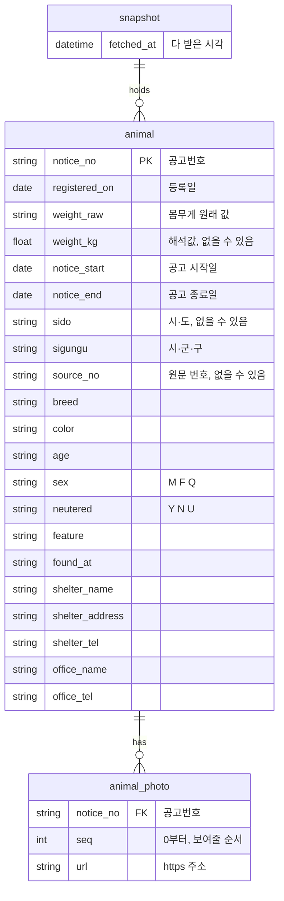

# ERD·DD — 포인핸드 대형묘 찾기

## 0. 이 문서가 다루는 것

**이 앱에는 저장하는 테이블이 없다.** 받아온 목록은 코어 메모리에만 있고, 앱을 끄면 사라진다([[PAW-INFRA-001#C1]] · [[PAW-INFRA-001]] 6장). DB도 파일도 없다.

그래서 이 문서는 물리 스키마가 아니라 **메모리에 드는 데이터의 논리 모델과 데이터 사전(DD)**이다. 테이블 하나 = 메모리의 목록 하나, 컬럼 하나 = 구조체 필드 하나로 읽는다. 컬럼마다 포인핸드 응답의 어느 칸에서 오는지를 함께 적는다 — 옮기는 코드(`adapters/pawinhand.rs`)가 이 표를 따른다([[PAW-DOM-002#PawinhandSource]]).

예시 값은 2026-09-30에 받은 4,225건 중 `경기-화성-2026-01287`이다. 건수 비고도 같은 날 기준이다.

## 1. ERD

- `snapshot`은 앱에 **많아야 한 줄**이다. 다 받으면 한 줄이 통째로 바뀐다([[PAW-DOM-001#Snapshot]])
- `animal`과 `animal_photo`는 그 한 줄에 딸린다. 스냅숏이 바뀌면 함께 바뀐다
- `SearchCondition`·`SearchResult`·`Fetch`·`Link`는 부를 때 만들었다 버리는 값이라 여기 없다

## 2. DD (데이터 사전)

#### snapshot

클래스: [[PAW-DOM-002#Snapshot]]

| 컬럼 | 타입 | 제약 | 의미 | 예시 |
|---|---|---|---|---|
| fetched_at | `DateTime<FixedOffset>` | NOT NULL | 마지막 쪽까지 다 받은 시각. 현지 시간대 | `2026-09-30T14:02:11+09:00` |

- 한 줄뿐이라 키가 없다. 줄이 없으면 「아직 다 받은 목록이 없음」이다(`no-snapshot`, [[PAW-API-001]] 1장)
- 마릿수(`total`)는 `animal` 줄 수로 센다. 따로 두지 않는다

#### animal

클래스: [[PAW-DOM-002#Animal]]

| 컬럼 | 타입 | 제약 | 의미 | 예시 |
|---|---|---|---|---|
| notice_no | `String` | PK, 비지 않음 | 공고번호. 받은 글자 그대로 — 칸 `notify_number` | `경기-화성-2026-01287` |
| registered_on | `NaiveDate` | NOT NULL | 등록일 — 칸 `registration_date`(8자리) | `2026-08-31` |
| weight_raw | `String` | NOT NULL, 빈 글자 허용 | 몸무게 원래 값. 공백도 그대로 — 칸 `weight` | `15(Kg)` |
| weight_kg | `Option<f64>` | 0 이상 30 이하 | 해석값([[PAW-PRD-001#R2]]). 숫자로 못 바꾸면 없음. 30 초과는 그램으로 보고 나누므로 30을 넘지 않는다 | `15.0` |
| notice_start | `NaiveDate` | NOT NULL | 공고 시작일 — 칸 `notify_sdt` | `2026-08-30` |
| notice_end | `NaiveDate` | NOT NULL | 공고 종료일 — 칸 `notify_edt` | `2026-08-30` |
| sido | `Option<String>` | | 시·도. 없으면 지역 미상(14건) — 칸 `city` | `경기도` |
| sigungu | `Option<String>` | | 시·군·구(4,225건 모두 있음) — 칸 `country` | `화성시` |
| source_no | `Option<String>` | 숫자만 | 국가동물보호정보시스템 원문 번호 — 칸 `detail_url`의 `desertion_no`(3,715건) | `441553202602482` |
| breed | `Option<String>` | | 품종 — 칸 `s_breeds` | `한국고양이` |
| color | `Option<String>` | | 털색 — 칸 `color` | `레몬색&흰색` |
| age | `Option<String>` | | 나이, 받은 글자 그대로(7건 비어 있음) — 칸 `age` | `2017(년생)` |
| sex | `Option<Sex>` | `M`·`F`·`Q` | 성별 — 칸 `sex` | `M` |
| neutered | `Option<Neutered>` | `Y`·`N`·`U` | 중성화 — 칸 `neutral` | `U` |
| feature | `Option<String>` | | 특징 — 칸 `feature` | `덩치가 매우 몹시큰 고양이/ 거대냥이/ …` |
| found_at | `Option<String>` | | 발견 장소 — 칸 `find_location` | `팔탄면 삼천병마로 인근` |
| shelter_name | `Option<String>` | | 보호소 이름 — 칸 `shelter_name` | `화성시민동물보호센터` |
| shelter_address | `Option<String>` | | 보호소 주소. 끝 공백을 지운다 — 칸 `shelter_address` | `경기도 화성시 서신면 전곡항로 492` |
| shelter_tel | `Option<String>` | | 보호소 전화(모두 있음) — 칸 `shelter_tel` | `010-3969-1034` |
| office_name | `Option<String>` | | 관할 기관 — 칸 `office_name` | `경기도 화성시` |
| office_tel | `Option<String>` | | 관할 기관 전화(2,939건 비어 있음) — 칸 `office_tel` | 없음 |

- 줄을 버리는 경우: `notify_number`가 비었을 때, 세 날짜 중 하나라도 8자리 날짜로 읽히지 않을 때([[PAW-UC-001#UC-S1]] 3a). 2026-09-30 데이터에서는 한 건도 없었다
- 공고번호가 같은 줄이 두 번 오면 하나만 남긴다
- 빈 글자와 공백뿐인 값은 없음(`None`)으로, 글자 앞뒤 공백은 지운다. `weight_raw`만 예외다
- 옮기지 않는 칸: `idx`, `animal_name`, `species`, `state`, `breeds`(`s_breeds`를 쓴다), `bell_count`·`click_count`·`comment_count`·`share_count`, `recommended`·`recommended_date`, `w_date`, `shelterAnimalInfo`, `more_info_idx` — [[PAW-DOM-001]] 4장

#### animal_photo

클래스: [[PAW-DOM-002#Photo]]

| 컬럼 | 타입 | 제약 | 의미 | 예시 |
|---|---|---|---|---|
| notice_no | `String` | FK → animal | 어느 아이의 사진인지. 코드에서는 `Animal.photos`에 들어 있어 따로 들지 않는다 | `경기-화성-2026-01287` |
| seq | `usize` | 0~3, 아이마다 유일 | 보여줄 순서. 0이 대표 사진 | `0` |
| url | `String` | https, 허용 호스트 둘 | 정리한 주소([[PAW-INFRA-001#C10]]) | `https://www.animal.go.kr/files/shelter/2026/07/202608311508874.jpg` |

- 칸 `more_image1` → `image` → `image2` → `image3` 순서로 채우고, 빈 칸·같은 주소·허용되지 않는 주소는 뺀다
- 건수: `image` 4,225, `image2` 3,169, `image3` 432, `more_image1` 25(모두 `image`도 있음). 사진이 하나도 없는 아이는 없었다

## 3. 인덱스와 정규화

**인덱스를 두지 않는다.**

| 질의 | 방식 | 이유 |
|---|---|---|
| 조건으로 거르기·정렬([[PAW-UC-001#UC-S3]]) | `animal` 전체 훑기 | 5천 건 안팎을 조건 셋으로 훑는 일은 1ms 안쪽이다. 조건을 바꿀 때마다 해도 사람이 느끼지 못한다 |
| 공고번호로 한 건 찾기(`open_link`) | 전체 훑기 | 사람이 링크를 누를 때만 한 번 일어난다 |
| 시·도별 마릿수 | 거르면서 함께 센다 | 따로 모아 둘 필요가 없다 |

건수가 몇만으로 늘어 조회가 눈에 띄게 느려지면 그때 공고번호 → 줄 위치 맵을 둔다. 지금 요구에는 없다(규약 1.9 과설계 금지).

**보호소·관할 기관 칸을 나누지 않는다.** 같은 보호소가 여러 줄에 되풀이되지만, 포인핸드는 보호소에 안정된 식별자를 주지 않고(이름·주소·전화가 공고마다 따로 온다) 앱은 보호소 단위로 묻는 일이 없다. 나눠도 얻는 것이 없고, 받은 값과 달라질 위험만 생긴다. 지역도 같은 이유로 `animal`에 둔다.

**메모리 크기.** 한 줄에 약 1KB로 잡으면 4,225건에 5MB 안팎이다. 새로고침 동안에는 새 목록을 다 받을 때까지 옛 목록이 함께 있어 잠깐 두 배가 된다.

## 4. 미결사항

- [x] 사용자가 정할 것은 없다. 저장을 하게 되면(1차 비목표) 이 문서가 물리 스키마로 바뀐다
