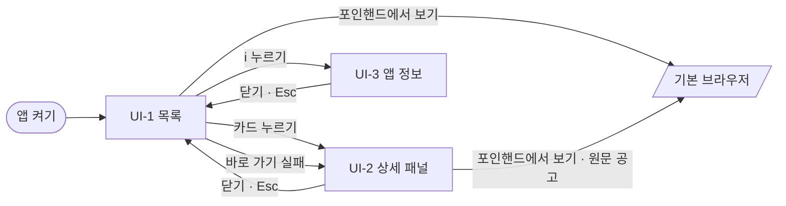

# 화면 설계·와이어프레임 — 포인핸드 대형묘 찾기

## 0. 이 문서가 다루는 것

화면 셋과 그 상태를 정한다: 목록(UI-1), 상세 패널(UI-2), 앱 정보(UI-3). 화면이 코어를 부르는 모양은 API 문서가, 화면 코드의 폴더는 클래스 명세가 정한다.

| 항목 | 값 |
|---|---|
| 창 크기 | 처음 1280×800, 최소 1024×680. 카드는 한 장 최소 280px로 들어가는 만큼 열을 세운다(1280이면 3열, 1024면 2열) |
| 표본 데이터 | 2026-09-30에 받은 실제 8kg 이상 15마리. 사진 자리는 털색을 닮은 빈 그림으로 그렸다 |
| 글꼴 | SUIT Variable (OFL-1.1). 앱에는 글꼴 파일을 넣는다 — 앱 화면은 외부 글꼴을 부를 수 없다([[PAW-INFRA-001]] 5장). 이 문서의 미리보기만 CDN에서 불러온다 |

**디자인 방향 — 저울.** 몸무게가 이 앱이 있는 이유라서, 노란색(`--weigh`)은 몸무게를 보여주는 곳에만 쓴다: 카드 사진 아래에 걸친 무게표, 몸무게 기준 눈금자의 핀. 나머지는 사진이 돋보이게 옅은 회색 바탕, 흑연색 글자, 짙은 초록(`--scale`) 버튼으로 조용히 둔다. 무게는 저울 표시처럼 늘 소수 한 자리로 쓴다.

**문구 원칙.** 사용자가 쓰는 말(공고·보호소·마리)로 쓴다. 실패 문구는 무엇이 안 됐는지와 어떻게 하면 되는지를 함께 쓰고, 사과하지 않는다.

## 1. 유스케이스 대응

| 유스케이스 | 화면 |
|---|---|
| [[PAW-UC-001#UC-H1]] 켜서 큰 고양이 목록 보기 | UI-1 |
| [[PAW-UC-001#UC-H2]] 조건을 바꿔 찾기 | UI-1 |
| [[PAW-UC-001#UC-H3]] 한 아이 자세히 보기 | UI-2 |
| [[PAW-UC-001#UC-H4]] 원래 공고 페이지로 가기 | UI-1 카드의 바로 가기, UI-2 |
| [[PAW-UC-001#UC-H5]] 새로고침 | UI-1 |
| [[PAW-UC-001#UC-H6]] 설치하기 | 화면 없음 — Tauri 설치 마법사(한국어) |
| [[PAW-UC-001#UC-A1]] 새 버전 배포하기 | 화면 없음 — GitHub |
| [[PAW-INFRA-001#C12]] 비공식 앱임을 밝힌다 | UI-1 왼쪽 아래, UI-3 |

## 2. 화면 목록

| 화면 | 경로 | 한 줄 목적 |
|---|---|---|
| UI-1 목록 | `/` — 앱의 화면 주소는 이것 하나 | 8kg 이상 고양이를 조건으로 좁혀 훑어본다 |
| UI-2 상세 패널 | UI-1 위 오른쪽 패널 | 한 아이의 정보를 모두 보고 포인핸드로 간다 |
| UI-3 앱 정보 | UI-1 위 대화상자 | 비공식 앱임과 데이터 출처를 밝힌다 |

## UI-1 목록

| 항목 | 내용 |
|---|---|
| 경로 | `/` |
| 주 유스케이스 | [[PAW-UC-001#UC-H1]] · [[PAW-UC-001#UC-H2]] · [[PAW-UC-001#UC-H5]] |
| 진입 / 이탈 | 앱을 켜면 바로 / 카드를 누르면 UI-2, i를 누르면 UI-3, 「포인핸드에서 보기」를 누르면 기본 브라우저 |

### 배치
```html
<div class="win">
  <header class="top" data-el="1">
    <h1 data-el="1.1">포인핸드 대형묘 찾기</h1>
    <span class="got" data-el="1.2">오늘 14:02, 보호 중인 고양이 4,225마리를 받았어요</span>
    <button class="btn" data-el="1.3">새로고침</button>
    <button class="btn info-btn" aria-label="앱 정보" data-el="1.4">i</button>
  </header>
  <aside class="side" data-el="2">
    <section>
      <h2>몸무게 기준</h2>
      <div class="wt" data-el="2.1"><input value="8.0" aria-label="몸무게 기준(kg)"><span>kg 이상</span></div>
      <div class="ruler" data-el="2.2" role="slider" aria-valuemin="0" aria-valuemax="20" aria-valuenow="8">
        <div class="ticks"></div>
        <div class="over" style="left:40%"></div>
        <div class="major" style="left:0"></div><div class="major" style="left:25%"></div><div class="major" style="left:50%"></div><div class="major" style="left:75%"></div><div class="major" style="left:calc(100% - 1px)"></div>
        <span class="lab" style="left:0;transform:none">0</span><span class="lab" style="left:25%">5</span><span class="lab" style="left:50%">10</span><span class="lab" style="left:75%">15</span><span class="lab" style="left:100%;transform:translateX(-100%)">20</span>
        <div class="pin" style="left:40%"></div>
      </div>
    </section>
    <section>
      <h2>등록 기간</h2>
      <div class="seg" data-el="2.3"><button class="on">전체</button><button>1년</button><button>6개월</button><button>3개월</button></div>
    </section>
    <section>
      <h2>지역</h2>
      <ul class="regions" data-el="2.4">
        <li class="on"><span>전국</span><b>15</b></li>
        <li><span>경기도</span><b>4</b></li>
        <li><span>서울특별시</span><b>4</b></li>
        <li><span>충청남도</span><b>2</b></li>
        <li><span>강원특별자치도</span><b>1</b></li>
        <li><span>경상북도</span><b>1</b></li>
        <li><span>인천광역시</span><b>1</b></li>
        <li><span>전남광주통합특별시</span><b>1</b></li>
        <li class="zero"><span>경상남도</span><b>0</b></li>
        <li class="zero"><span>대구광역시</span><b>0</b></li>
        <li class="zero"><span>대전광역시</span><b>0</b></li>
        <li class="zero"><span>부산광역시</span><b>0</b></li>
        <li class="zero"><span>세종특별자치시</span><b>0</b></li>
        <li class="zero"><span>울산광역시</span><b>0</b></li>
        <li class="zero"><span>전북특별자치도</span><b>0</b></li>
        <li class="zero"><span>제주특별자치도</span><b>0</b></li>
        <li class="zero"><span>충청북도</span><b>0</b></li>
        <li><span>지역 미상</span><b>1</b></li>
      </ul>
    </section>
    <p class="note" data-el="2.5">포인핸드 공식 앱이 아닙니다. 포인핸드에 공개된 공고를 모아 보여줍니다.</p>
  </aside>
  <main class="main">
    <div class="head" data-el="3">
      <p class="count" data-el="3.1">15마리</p>
      <label class="sort" data-el="3.2">정렬 <select><option>무거운 순</option><option>최근 등록 순</option></select></label>
    </div>
    <div class="grid" data-el="4">
      <article class="card" tabindex="0" data-el="5">
        <div class="ph t-ginger"><span class="st keep" data-el="5.1">보호중</span><span class="kg" data-el="5.2">15.0<small>kg</small></span></div>
        <div class="body">
          <p class="who" data-el="5.3">2017년생 수컷</p>
          <p class="where" data-el="5.4">화성시민동물보호센터, 경기도 화성시</p>
          <p class="when" data-el="5.5">공고 2026.08.30 ~ 08.30</p>
          <a class="go" href="#" data-el="5.6">포인핸드에서 보기</a>
        </div>
      </article>
      <article class="card" tabindex="0">
        <div class="ph t-black"><span class="st keep">보호중</span><span class="kg">15.0<small>kg</small></span></div>
        <div class="body">
          <p class="who">2024년생 암컷</p>
          <p class="where">한국동물구조관리협회, 서울특별시 종로구</p>
          <p class="when">공고 2025.06.05 ~ 06.16</p>
          <a class="go" href="#">포인핸드에서 보기</a>
        </div>
      </article>
      <article class="card" tabindex="0">
        <div class="ph t-black"><span class="st keep">보호중</span><span class="kg">15.0<small>kg</small></span></div>
        <div class="body">
          <p class="who">2022년생 암컷</p>
          <p class="where">한국동물구조관리협회, 서울특별시 종로구</p>
          <p class="when">공고 2025.06.05 ~ 06.16</p>
          <a class="go" href="#">포인핸드에서 보기</a>
        </div>
      </article>
      <article class="card" tabindex="0">
        <div class="ph t-calico"><span class="st keep">보호중</span><span class="kg">12.0<small>kg</small></span></div>
        <div class="body">
          <p class="who">2016년생 암컷</p>
          <p class="where">화성시민동물보호센터, 경기도 화성시</p>
          <p class="when">공고 2026.08.30 ~ 08.30</p>
          <a class="go" href="#">포인핸드에서 보기</a>
        </div>
      </article>
      <article class="card" tabindex="0">
        <div class="ph t-white"><span class="st keep">보호중</span><span class="kg">10.0<small>kg</small></span></div>
        <div class="body">
          <p class="who">2023년생 수컷</p>
          <p class="where">청양보호소, 충청남도 청양군</p>
          <p class="when">공고 2025.11.14 ~ 11.24</p>
          <a class="go" href="#">포인핸드에서 보기</a>
        </div>
      </article>
      <article class="card" tabindex="0">
        <div class="ph t-tabby"><span class="st keep">보호중</span><span class="kg">10.0<small>kg</small></span></div>
        <div class="body">
          <p class="who">2022년생 수컷</p>
          <p class="where">동대문구청, 서울특별시 동대문구</p>
          <p class="when">공고 2025.08.04 ~ 08.14</p>
          <a class="go" href="#">포인핸드에서 보기</a>
        </div>
      </article>
    </div>
  </main>
</div>

<div class="var">받는 중(6) — 처음 켰을 때. 조건은 받기가 끝날 때까지 누를 수 없다</div>
<div class="win short">
  <header class="top">
    <h1>포인핸드 대형묘 찾기</h1>
    <span class="got">아직 받은 목록이 없어요</span>
    <button class="btn" disabled>받는 중…</button>
    <button class="btn info-btn" aria-label="앱 정보">i</button>
  </header>
  <aside class="side dimmed"><section><h2>몸무게 기준</h2><div class="wt"><input value="8.0" aria-label="몸무게 기준(kg)"><span>kg 이상</span></div></section><section><h2>등록 기간</h2><div class="seg"><button class="on">전체</button><button>1년</button><button>6개월</button><button>3개월</button></div></section></aside>
  <main class="main">
    <div class="center" data-el="6">
      <p class="t">포인핸드에서 보호 중인 고양이를 받고 있어요</p>
      <div class="bar" role="progressbar" aria-label="받는 중"></div>
      <p class="d">2,000마리 받음</p>
    </div>
  </main>
</div>

<div class="var">받아오기 실패(7) — 처음 켰을 때, 시간 초과의 예. 제목·이유 문장은 실패 종류마다 다르다(규칙)</div>
<div class="win short">
  <header class="top">
    <h1>포인핸드 대형묘 찾기</h1>
    <span class="got">아직 받은 목록이 없어요</span>
    <button class="btn">새로고침</button>
    <button class="btn info-btn" aria-label="앱 정보">i</button>
  </header>
  <aside class="side dimmed"><section><h2>몸무게 기준</h2><div class="wt"><input value="8.0" aria-label="몸무게 기준(kg)"><span>kg 이상</span></div></section><section><h2>등록 기간</h2><div class="seg"><button class="on">전체</button><button>1년</button><button>6개월</button><button>3개월</button></div></section></aside>
  <main class="main">
    <div class="center" data-el="7">
      <p class="t">포인핸드에 연결하지 못했어요</p>
      <p class="d">포인핸드가 15초 동안 응답하지 않았어요. 잠시 뒤 다시 시도하세요.</p>
      <button class="btn primary">다시 시도</button>
    </div>
  </main>
</div>

<div class="var">새로고침 실패(8) — 연결 실패의 예. 보던 목록과 받은 시각은 그대로 둔다</div>
<div class="win short">
  <header class="top">
    <h1>포인핸드 대형묘 찾기</h1>
    <span class="got">오늘 14:02, 보호 중인 고양이 4,225마리를 받았어요</span>
    <button class="btn">새로고침</button>
    <button class="btn info-btn" aria-label="앱 정보">i</button>
  </header>
  <aside class="side"><section><h2>몸무게 기준</h2><div class="wt"><input value="8.0" aria-label="몸무게 기준(kg)"><span>kg 이상</span></div></section><section><h2>등록 기간</h2><div class="seg"><button class="on">전체</button><button>1년</button><button>6개월</button><button>3개월</button></div></section></aside>
  <main class="main">
    <div class="banner err" role="alert" data-el="8">
      <p><b>새로 받지 못했어요.</b> 인터넷에 연결되어 있는지 확인한 뒤 다시 시도하세요. 지금 보이는 목록은 오늘 14:02에 받은 거예요.</p>
      <button class="btn">다시 시도</button>
    </div>
    <div class="head"><p class="count">15마리</p><label class="sort">정렬 <select><option>무거운 순</option></select></label></div>
    <div class="grid">
      <article class="card"><div class="ph t-ginger"><span class="st keep">보호중</span><span class="kg">15.0<small>kg</small></span></div><div class="body"><p class="who">2017년생 수컷</p><p class="where">화성시민동물보호센터, 경기도 화성시</p></div></article>
      <article class="card"><div class="ph t-black"><span class="st keep">보호중</span><span class="kg">15.0<small>kg</small></span></div><div class="body"><p class="who">2024년생 암컷</p><p class="where">한국동물구조관리협회, 서울특별시 종로구</p></div></article>
      <article class="card"><div class="ph t-black"><span class="st keep">보호중</span><span class="kg">15.0<small>kg</small></span></div><div class="body"><p class="who">2022년생 암컷</p><p class="where">한국동물구조관리협회, 서울특별시 종로구</p></div></article>
    </div>
  </main>
</div>

<div class="var">조건에 맞는 아이가 없음(9) — 경상남도, 최근 3개월</div>
<div class="win short">
  <header class="top">
    <h1>포인핸드 대형묘 찾기</h1>
    <span class="got">오늘 14:02, 보호 중인 고양이 4,225마리를 받았어요</span>
    <button class="btn">새로고침</button>
    <button class="btn info-btn" aria-label="앱 정보">i</button>
  </header>
  <aside class="side"><section><h2>등록 기간</h2><div class="seg"><button>전체</button><button>1년</button><button>6개월</button><button class="on">3개월</button></div></section><section><h2>지역</h2><ul class="regions"><li><span>전국</span><b>6</b></li><li class="on"><span>경상남도</span><b>0</b></li></ul></section></aside>
  <main class="main">
    <div class="center" data-el="9">
      <p class="t">조건에 맞는 아이가 없어요</p>
      <p class="d">지금 조건은 8.0kg 이상, 최근 3개월, 경상남도예요. 몸무게 기준을 낮추거나 기간이나 지역을 넓혀 보세요.</p>
    </div>
  </main>
</div>

<div class="var">카드 두 가지 — 공고중인 아이, 사진을 불러오지 못한 아이(10)</div>
<div class="frag">
  <article class="card"><div class="ph t-white"><span class="st notice">공고중</span><span class="kg">8.0<small>kg</small></span></div><div class="body"><p class="who">2025년생 수컷</p><p class="where">삼척시동물보호센터, 강원특별자치도 삼척시</p><p class="when">공고 2026.09.23 ~ 10.06</p><a class="go" href="#">포인핸드에서 보기</a></div></article>
  <article class="card"><div class="ph none" data-el="10"><span class="st keep">보호중</span><span class="kg">9.0<small>kg</small></span></div><div class="body"><p class="who">2021년생 성별 미상</p><p class="where">둔촌동물병원, 서울특별시 강동구</p><p class="when">공고 2026.07.02 ~ 07.16</p><a class="go" href="#">포인핸드에서 보기</a></div></article>
</div>

<div class="var">몸무게 기준에 잘못된 값(11) — 목록은 마지막으로 올바르던 기준 그대로</div>
<div class="frag" style="width:280px;flex-direction:column;background:var(--surface)">
  <div class="wt"><input class="bad" value="-3" aria-label="몸무게 기준(kg)"><span>kg 이상</span></div>
  <p class="hint" data-el="11">0 이상의 숫자를 넣으세요. 목록은 8.0kg 기준 그대로예요.</p>
</div>
```

### 요소
| # | 이름 | 종류 | 보여주는 것 | 누르면 |
|---|---|---|---|---|
| 1 | 윗줄 | 머리글 | 앱 이름, 받은 시각, 새로고침, 앱 정보 | — |
| 1.2 | 받은 시각 | 글 | 마지막으로 다 받은 시각과 받은 마릿수 | — |
| 1.3 | 새로고침 | 버튼 | 받는 중에는 「받는 중…」으로 바뀌고 눌리지 않는다 | 다시 받는다 |
| 1.4 | 앱 정보 | 동그란 버튼 | i | UI-3을 연다 |
| 2.1 | 몸무게 기준 | 숫자 칸 | 기준 kg, 소수 한 자리 | 바꾸고 입력이 멈추면 다시 거른다 |
| 2.2 | 눈금자 | 슬라이더 | 0~20kg 눈금, 기준 위치(노란 핀), 기준 이상 구간(옅은 노랑) | 끄는 동안은 칸과 핀만 따라오고, 놓으면 0.1kg 단위로 기준이 바뀐다 |
| 2.3 | 등록 기간 | 네 칸 중 하나 고르기 | 전체 · 1년 · 6개월 · 3개월 | 바로 다시 거른다 |
| 2.4 | 지역 | 목록에서 하나 고르기 | 시·도와 그 시·도의 마릿수 | 바로 다시 거른다 |
| 2.5 | 비공식 안내 | 글 | 포인핸드 공식 앱이 아님 | — |
| 3.1 | 마릿수 | 큰 숫자 | 지금 조건에 걸린 수 | — |
| 3.2 | 정렬 | 드롭다운 | 무거운 순 · 최근 등록 순 | 바로 다시 정렬한다 |
| 5 | 카드 | 카드 | 한 마리 | UI-2를 연다 |
| 5.1 | 상태 배지 | 배지 | 보호중(채움) · 공고중(테두리) | — |
| 5.2 | 무게표 | 노란 표 | 해석한 kg | — |
| 5.3 | 나이·성별 | 글 | 「2017년생 수컷」 | — |
| 5.4 | 보호소·지역 | 글 | 「화성시민동물보호센터, 경기도 화성시」 | — |
| 5.5 | 공고 기간 | 글 | 「공고 2026.08.30 ~ 08.30」 | — |
| 5.6 | 포인핸드에서 보기 | 링크 | 바깥 창 아이콘이 붙은 글자 | UI-2를 거치지 않고 기본 브라우저로 포인핸드 상세를 연다. 실패하면 그 아이의 UI-2를 연다 |
| 6 | 받는 중 | 안내 | 문구, 움직이는 막대, 받은 마릿수 | — |
| 7 | 받아오기 실패 | 안내 | 제목, 이유 문장, 다시 시도 | 다시 받는다 |
| 8 | 새로고침 실패 띠 | 띠 | 이유와 지금 목록을 받은 시각 | 다시 시도하면 다시 받는다 |
| 9 | 0마리 안내 | 안내 | 지금 조건과 넓히는 법 | — |
| 10 | 사진 없음 | 빈 그림 | 고양이 윤곽과 「사진 없음」 | — |
| 11 | 잘못된 기준 | 경고 글 | 빨간 칸과 안내 | — |

### 규칙

**보여주는 글**
- 무게는 늘 소수 한 자리다: `15` → 15.0, `8.1` → 8.1 ([[PAW-DOM-001#Weight]])
- 나이: `2017(년생)` → 「2017년생」, `2026(60일미만)(년생)` → 「2026년생 (60일 미만)」. 두 모양이 아니면 받은 글자 그대로 쓰고, 비어 있으면 성별만 쓴다
- 성별: `M` 수컷 · `F` 암컷 · `Q` 성별 미상
- 공고 기간: 「공고 2026.08.30 ~ 08.30」 — 끝 날짜가 시작과 같은 해면 월.일만, 해가 다르면 연도까지
- 상태 배지: 보호중은 초록 채움, 공고중은 초록 테두리. 판정은 [[PAW-DOM-001#NoticePeriod]]. 켜 둔 채 날짜가 바뀌면 다시 걸러 새 날짜로 맞춘다
- 보호소와 지역은 한 줄로 「보호소 이름, 시·도 시·군·구」. 시·도가 비면 시·군·구만, 시·군·구가 시·도와 같으면(제주·세종) 한 번만
- 받은 시각(1.2): 오늘이면 「오늘 14:02」, 아니면 「9월 29일 14:02」, 뒤에 「, 보호 중인 고양이 4,225마리를 받았어요」. 받은 적이 없으면 「아직 받은 목록이 없어요」
- 카드 사진은 첫 사진이다([[PAW-DOM-001#Photo]] 순서). 없거나 못 불러오면 10. 새로 받으면 못 불러왔던 사진을 다시 불러온다

**조건**
- 조건(2.1~2.4, 3.2)을 바꾸면 다시 받지 않고 바로 거른다. 결과 목록은 맨 위로 올라간다. 이미 고른 칸을 다시 누르면 아무 일도 없다
- 2.1과 2.2는 같은 값이다. 하나를 바꾸면 다른 하나가 따라온다. 눈금자는 0~20kg만 보이지만 숫자 칸에는 20보다 큰 값도 넣을 수 있다 — 그때 핀은 오른쪽 끝에 붙는다
- 2.2는 끄는 동안 칸과 핀만 따라오고 놓을 때 한 번 거른다 — 기준을 낮추면 수천 마리가 걸려 끄는 동안마다 거르면 느려진다
- 2.1은 10진수만 받는다. 숫자가 아니거나(`1e3`·`0x10` 같은 모양 포함) 0보다 작은 값을 넣으면 칸이 빨갛게 되고 11이 뜬다. 목록은 마지막으로 올바르던 기준으로 둔다([[PAW-UC-001#UC-H2]] 4a)
- 지역 목록 순서: 전국 → 마릿수 많은 순(같으면 가나다) → 0마리인 시·도(흐리게, 가나다) → 지역 미상(늘 맨 끝). 0마리도 고를 수 있다. 숫자는 지역 조건만 뺀 나머지 조건으로 센 수다([[PAW-DOM-001#SearchResult]])
- 새로고침 뒤 고른 시·도나 지역 미상이 데이터에서 아예 사라지면 지역을 전국으로 돌리고, 목록 위에 옅은 초록 띠로 「경상남도에 보호 중인 아이가 없어 지역을 전국으로 바꿨어요」(지역 미상이면 「지역 미상에 …」)를 보여준다([[PAW-UC-001#UC-H5]] 4a). 조건을 바꾸거나 다시 새로고침하면 띠는 사라진다
- 앱을 다시 켜면 조건은 기본값(8.0kg 이상, 전체 기간, 전국, 무거운 순)이다

**목록 그리기**
- 카드는 60장씩 그린다. 목록 끝이 가까워지면 다음 60장을 더 그린다 — 기준을 낮춰 수천 마리가 걸려도 창이 멈추지 않게. 3.1의 마릿수는 그린 수가 아니라 걸린 수 전부다
- 새로고침은 조건이 그대로라 보던 자리와 그린 만큼을 지킨다(목록을 맨 위로 올리지 않는다)

**받아오기**
- 처음 켤 때는 6을 보여주고 조건을 흐리게 해 누를 수 없게 한다. 숫자는 받은 마릿수로, 1,000마리 안팎씩 오른다(첫 쪽을 받기 전에는 비워 둔다)
- 새로고침 중에는 1.3이 「받는 중…」으로 바뀌고 눌리지 않는다. 목록과 조건은 그대로 쓸 수 있다 — 거르기는 지금 목록으로 한다
- 실패 제목과 이유 문장은 실패 종류([[PAW-DOM-001#Fetch]])마다 다르다

| 실패 종류 | 7의 제목 | 이유 문장 |
|---|---|---|
| 연결 실패 | 포인핸드에 연결하지 못했어요 | 인터넷에 연결되어 있는지 확인한 뒤 다시 시도하세요. |
| 시간 초과 | 포인핸드에 연결하지 못했어요 | 포인핸드가 15초 동안 응답하지 않았어요. 잠시 뒤 다시 시도하세요. |
| 형식 이상 | 포인핸드 목록을 읽지 못했어요 | 포인핸드가 예상과 다른 형식으로 답했어요. 새 버전이 나왔는지 확인하세요. |
| 쪽 수 초과 | 포인핸드 목록을 읽지 못했어요 | 목록이 비정상적으로 길어 받기를 멈췄어요. 새 버전이 나왔는지 확인하세요. |

- 8(새로고침 실패)은 「새로 받지 못했어요.」 + 이유 문장 + 「지금 보이는 목록은 {받은 시각}에 받은 거예요.」. 목록과 받은 시각은 그대로 둔다([[PAW-UC-001#UC-H5]] 3a). 다시 시도하거나 새로고침이 성공하면 사라진다. 다시 받는 동안 띠의 「다시 시도」도 눌리지 않는다
- 띠(8과 지역 초기화 띠)는 목록을 내려 봐도 목록 위쪽에 붙어 보인다 — 내려 본 채 새로고침이 실패해도 놓치지 않게
- 9(0마리)는 「지금 조건은 {기준}kg 이상, {기간}, {지역}이에요.」 — 지역 이름 끝 글자에 받침이 있으면 「이에요」, 없으면 「예요」. 이어서 「몸무게 기준을 낮추거나 기간이나 지역을 넓혀 보세요.」 9가 뜨면 마릿수·정렬 줄은 두지 않는다

**누르기와 키보드**
- 카드 어디를 눌러도 UI-2가 열린다. 카드 안의 5.6만은 UI-2를 열지 않고 바로 기본 브라우저로 간다
- 5.6이 실패하면 — 기본 브라우저를 열지 못했거나 열 수 없는 주소일 때 — UI-1에는 알릴 자리가 없으므로 그 아이의 UI-2를 열고 UI-2의 6(또는 「열 수 없는 주소예요」)을 보여준다. 그사이 UI-3이 떠 있으면 닫는다
- Tab 순서는 윗줄 → 조건 → 정렬 → 카드. 카드에서 Enter를 누르면 UI-2. 포커스는 초록 테두리(2px)로 보인다
- 눈금자는 마우스 왼쪽 버튼으로만 움직인다. 키보드로도 움직인다: ←↓ 0.1kg 내리기, →↑ 0.1kg 올리기, PageDown·PageUp 1kg, Home 0, End 20

### 시나리오
**S-1 켜서 훑어보기** — [[PAW-UC-001#UC-H1]]
1. 앱을 켜면 6이 뜨고 받은 마릿수가 오른다
2. 다 받으면 15마리가 무거운 순으로 뜨고, 1.2에 받은 시각이 찍힌다
3. 카드의 5.6을 누르면 기본 브라우저에 그 아이의 포인핸드 상세가 열린다

**S-2 가까운 곳, 최근 공고만** — [[PAW-UC-001#UC-H2]]
1. 2.4에서 경기도(4)를 누르면 바로 4마리가 된다
2. 2.3에서 3개월을 누르면 2마리가 된다
3. 2.1을 7로 내리면 7kg 이상인 아이까지 들어온다
4. 3.2를 최근 등록 순으로 바꿔 새로 올라온 아이부터 본다

**S-3 새로고침** — [[PAW-UC-001#UC-H5]]
1. 1.3을 누르면 「받는 중…」으로 바뀐다
2. 성공하면 1.2의 받은 시각이 바뀌고 조건과 보던 자리는 그대로다
3. 실패하면 8이 뜨고 목록은 그대로다

## UI-2 상세 패널

| 항목 | 내용 |
|---|---|
| 경로 | UI-1 위 오른쪽 패널(주소 없음) |
| 주 유스케이스 | [[PAW-UC-001#UC-H3]] · [[PAW-UC-001#UC-H4]] |
| 진입 / 이탈 | UI-1에서 카드를 누름, 또는 카드의 「포인핸드에서 보기」가 실패함 / 닫기·Esc·흐린 바깥을 누르면 UI-1, 링크를 누르면 기본 브라우저(패널은 그대로) |

### 배치
```html
<div class="win">
  <header class="top">
    <h1>포인핸드 대형묘 찾기</h1>
    <span class="got">오늘 14:02, 보호 중인 고양이 4,225마리를 받았어요</span>
    <button class="btn">새로고침</button>
    <button class="btn info-btn" aria-label="앱 정보">i</button>
  </header>
  <aside class="side"><section><h2>몸무게 기준</h2><div class="wt"><input value="8.0" aria-label="몸무게 기준(kg)"><span>kg 이상</span></div></section><section><h2>등록 기간</h2><div class="seg"><button class="on">전체</button><button>1년</button><button>6개월</button><button>3개월</button></div></section></aside>
  <main class="main">
    <div class="head"><p class="count">15마리</p><label class="sort">정렬 <select><option>무거운 순</option></select></label></div>
    <div class="grid">
      <article class="card"><div class="ph t-ginger"><span class="st keep">보호중</span><span class="kg">15.0<small>kg</small></span></div><div class="body"><p class="who">2017년생 수컷</p><p class="where">화성시민동물보호센터, 경기도 화성시</p></div></article>
      <article class="card"><div class="ph t-black"><span class="st keep">보호중</span><span class="kg">15.0<small>kg</small></span></div><div class="body"><p class="who">2024년생 암컷</p><p class="where">한국동물구조관리협회, 서울특별시 종로구</p></div></article>
      <article class="card"><div class="ph t-black"><span class="st keep">보호중</span><span class="kg">15.0<small>kg</small></span></div><div class="body"><p class="who">2022년생 암컷</p><p class="where">한국동물구조관리협회, 서울특별시 종로구</p></div></article>
    </div>
  </main>
  <div class="shade"></div>
  <aside class="panel" role="dialog" aria-label="보호 동물 상세" data-el="1">
    <header class="p-head">
      <span class="st keep" data-el="1.1">보호중</span>
      <span class="no" data-el="1.2">경기-화성-2026-01287</span>
      <button class="btn" data-el="1.3">닫기</button>
    </header>
    <div class="p-body">
      <div class="gallery" data-el="2">
        <div class="ph t-ginger"></div>
        <div class="thumbs"><div class="ph t-ginger sel"></div><div class="ph t-white"></div></div>
      </div>
      <div class="weight" data-el="3">
        <span class="kg">15.0<small>kg</small></span>
        <span class="raw">원래 값 15(Kg)</span>
      </div>
      <dl class="facts" data-el="4">
        <dt>나이</dt><dd>2017년생</dd>
        <dt>성별</dt><dd>수컷</dd>
        <dt>중성화</dt><dd>미확인</dd>
        <dt>품종</dt><dd>한국고양이</dd>
        <dt>털색</dt><dd>레몬색&amp;흰색</dd>
        <dt>특징</dt><dd>덩치가 매우 몹시큰 고양이/ 거대냥이/ 순하고 겁이 조금 있음/ 지금은 숨고싶어함</dd>
        <dt>발견 장소</dt><dd>팔탄면 삼천병마로 인근</dd>
        <dt>공고 기간</dt><dd>2026.08.30 ~ 2026.08.30</dd>
        <h3>보호소</h3>
        <dt>이름</dt><dd>화성시민동물보호센터</dd>
        <dt>주소</dt><dd>경기도 화성시 서신면 전곡항로 492</dd>
        <dt>전화</dt><dd>010-3969-1034</dd>
        <h3>관할 기관</h3>
        <dt>이름</dt><dd>경기도 화성시</dd>
        <dt>전화</dt><dd class="empty">정보 없음</dd>
      </dl>
    </div>
    <footer class="p-foot" data-el="5">
      <button class="btn primary wide" data-el="5.1">포인핸드에서 보기</button>
      <a class="small" href="#" data-el="5.2">국가동물보호정보시스템 원문 공고 보기</a>
    </footer>
  </aside>
</div>

<div class="var">원문 공고 번호가 없는 아이(예: 서울-동대문-2025-00237) — 원문 링크를 두지 않는다</div>
<div class="frag pane">
  <footer class="p-foot" style="width:100%;border-top:0">
    <button class="btn primary wide">포인핸드에서 보기</button>
  </footer>
</div>

<div class="var">브라우저를 열지 못했을 때(6) — 주소를 보여주고 복사하게 한다</div>
<div class="frag pane">
  <footer class="p-foot" style="width:100%;border-top:0" data-el="6">
    <p class="inline-err">기본 브라우저를 열지 못했어요. 아래 주소를 복사해 브라우저 주소창에 붙여 넣으세요.</p>
    <div class="copy"><input readonly value="https://pawinhand.kr/shelter/animal/detail/%EA%B2%BD%EA%B8%B0-%ED%99%94%EC%84%B1-2026-01287" aria-label="열려던 주소"><button class="btn">주소 복사</button></div>
    <button class="btn primary wide">포인핸드에서 보기</button>
  </footer>
</div>
```

### 요소
| # | 이름 | 종류 | 보여주는 것 | 누르면 |
|---|---|---|---|---|
| 1 | 상세 패널 | 오른쪽 패널(너비 520px) | 한 마리의 모든 정보 | 흐린 바깥이나 Esc를 누르면 닫힌다 |
| 1.1 | 상태 배지 | 배지 | 보호중 · 공고중 | — |
| 1.2 | 공고번호 | 글 | 받은 그대로 | — |
| 1.3 | 닫기 | 버튼 | — | UI-1로 돌아간다 |
| 2 | 사진 | 큰 사진과 작은 사진 | 최대 3장. 작은 사진 줄은 2장 이상일 때만 | 작은 사진을 누르면 큰 사진이 바뀐다 |
| 3 | 무게 | 노란 표와 원래 값 | 「15.0kg」과 「원래 값 15(Kg)」 | — |
| 4 | 정보 | 두 칸 표 | 아이 8줄, 보호소 3줄, 관할 기관 2줄 | — |
| 5.1 | 포인핸드에서 보기 | 주 버튼 | — | 기본 브라우저로 포인핸드 상세를 연다 |
| 5.2 | 원문 공고 보기 | 밑줄 링크 | 원문 번호가 있을 때만 | 기본 브라우저로 국가동물보호정보시스템 공고를 연다 |
| 6 | 브라우저 열기 실패 | 경고와 주소 칸 | 열려던 주소 | 주소 복사를 누르면 클립보드에 담고, 버튼 글이 「복사했어요」로 바뀐다 |

### 규칙
- 패널은 오른쪽에서 밀려 나온다(200ms). 움직임 줄이기 설정이면 바로 나타난다. 뒤 목록은 흐리게 두고 스크롤 위치를 바꾸지 않는다
- 닫는 법은 셋: 닫기, Esc, 흐린 바깥 누르기. 닫으면 포커스가 눌렀던 카드로 돌아간다([[PAW-UC-001#UC-H3]] 최소 보장)
- 패널이 열려 있는 동안 뒤 목록과 윗줄은 누를 수 없다. 열리면 포커스가 닫기에 간다
- 패널은 연 때의 아이를 보여준다 — 새로고침이 끝나 그 아이가 목록에서 빠져도 패널은 그대로 떠 있고 닫을 수 있다
- UI-1 카드의 「포인핸드에서 보기」가 실패해서 열렸을 때는 처음부터 6(또는 「열 수 없는 주소예요」)이 보이는 채로 열린다
- 정보 줄 순서는 고정이다: 나이 · 성별 · 중성화 · 품종 · 털색 · 특징 · 발견 장소 · 공고 기간 / 보호소 이름 · 주소 · 전화 / 관할 기관 이름 · 전화. 값이 비면 줄을 숨기지 않고 흐린 「정보 없음」을 쓴다([[PAW-UC-001#UC-H3]] 2b)
- 중성화: `Y` 했음 · `N` 안 했음 · `U` 미확인. 나이·성별은 UI-1과 같은 규칙
- 공고 기간은 상세에서 연도까지 모두 쓴다
- 원래 값은 받은 글자 그대로 보인다. 무게표는 늘 있다 — 몸무게가 없는 아이는 목록에 걸리지 않는다
- 사진은 [[PAW-DOM-001#Photo]] 순서의 앞 3장이다. 못 불러온 사진은 빼고 보여주고, 하나도 없거나 하나도 못 불러오면 빈 그림 하나([[PAW-UC-001#UC-H3]] 2a)
- 링크 주소는 코어가 만든다 — 화면은 공고번호와 링크 종류만 넘긴다([[PAW-UC-001#UC-S4]]). 5.2는 원문 번호가 없는 아이에게 보이지 않는다([[PAW-UC-001#UC-H4]] 1b)
- 코어가 「열 수 없는 주소」라고 거절하면 6 자리에 「열 수 없는 주소예요」만 보여준다(주소 칸 없음)
- 브라우저를 열지 못하면 6이 뜬다. 주소 칸은 읽기 전용이고 누르면 전체가 선택된다. 「주소 복사」로 클립보드에 담으면 버튼 글이 「복사했어요」가 된다. 클립보드에 담지 못하는 환경이면 선택된 채로 두어 Ctrl+C로 복사하게 한다
- 다시 눌러 링크가 열리면 6은 사라진다

### 시나리오
**S-1 자세히 보고 포인핸드로** — [[PAW-UC-001#UC-H3]] · [[PAW-UC-001#UC-H4]]
1. UI-1에서 15.0kg 화성 카드를 누르면 패널이 열린다
2. 두 번째 작은 사진을 눌러 큰 사진을 바꿔 본다
3. 무게 옆 「원래 값 15(Kg)」와 특징을 읽는다
4. 5.1을 누르면 기본 브라우저에 포인핸드 상세가 열리고, 패널은 그대로 있다
5. Esc로 닫으면 목록의 같은 자리, 같은 카드로 돌아온다

## UI-3 앱 정보

| 항목 | 내용 |
|---|---|
| 경로 | UI-1 위 대화상자(주소 없음) |
| 주 유스케이스 | — (근거: [[PAW-INFRA-001#C12]]) |
| 진입 / 이탈 | UI-1의 i를 누름 / 닫기·Esc·흐린 바깥을 누르면 UI-1 |

### 배치
```html
<div class="win" style="height:560px">
  <header class="top">
    <h1>포인핸드 대형묘 찾기</h1>
    <span class="got">오늘 14:02, 보호 중인 고양이 4,225마리를 받았어요</span>
    <button class="btn">새로고침</button>
    <button class="btn info-btn" aria-label="앱 정보">i</button>
  </header>
  <aside class="side"></aside>
  <main class="main"><div class="head"><p class="count">15마리</p></div></main>
  <div class="shade"></div>
  <div class="dialog" role="dialog" aria-label="앱 정보" data-el="1">
    <h2>포인핸드 대형묘 찾기</h2>
    <p class="ver" data-el="2">버전 0.1.0</p>
    <p class="lead" data-el="3">포인핸드 공식 앱이 아닙니다.</p>
    <p>포인핸드(pawinhand.kr)에 공개된 보호 동물 공고 가운데 몸무게가 기준 이상인 고양이를 모아 보여줍니다. 입양 문의와 신청은 포인핸드나 각 보호소에서 하세요.</p>
    <p class="fine" data-el="4">받아온 목록은 이 PC에 저장하지 않아요. 켤 때마다 새로 받아요.</p>
    <p class="fine">사진은 국가동물보호정보시스템과 포인핸드에서 불러와요.</p>
    <p class="fine" data-el="5">소스 코드 github.com/HoyoungParkme/fourinhand-crawl</p>
    <div class="row"><button class="btn primary" data-el="6">닫기</button></div>
  </div>
</div>
```

### 요소
| # | 이름 | 종류 | 보여주는 것 | 누르면 |
|---|---|---|---|---|
| 1 | 앱 정보 | 대화상자(너비 440px) | 앱 이름과 아래 내용 | 흐린 바깥이나 Esc를 누르면 닫힌다 |
| 2 | 버전 | 글 | 설치된 앱의 버전 | — |
| 3 | 비공식 안내 | 강조 칸 | 포인핸드 공식 앱이 아님 | — |
| 4 | 저장 안내 | 글 | 받아온 목록을 저장하지 않음 | — |
| 5 | 소스 코드 주소 | 글 | 저장소 주소 | 누를 수 없다 |
| 6 | 닫기 | 주 버튼 | — | UI-1로 돌아간다 |

### 규칙
- 버전은 설치된 앱이 스스로 밝히는 버전이다 — 설정의 버전 한 곳에서 온다([[PAW-INFRA-001]] 8.4)
- 비공식 안내는 UI-1의 2.5, README와 같은 뜻으로 맞춘다([[PAW-INFRA-001#C12]])
- 소스 코드 주소는 글자로만 보인다. 앱이 여는 링크는 포인핸드와 국가동물보호정보시스템 두 곳뿐이다([[PAW-INFRA-001]] 5장)
- 열리면 포커스가 닫기 버튼에 간다. 닫으면 i 버튼으로 돌아온다

## 3. 디자인 토큰 · 공통 틀

이 html 블록은 모든 화면 앞에 들어간다. 토큰(`:root`)과 화면이 함께 쓰는 부품이다.

```html
<link rel="stylesheet" href="https://cdn.jsdelivr.net/gh/sun-typeface/SUIT@2/fonts/variable/woff2/SUIT-Variable.css">
<style>
  :root{
    --paper:#EEF0EB; --surface:#FFFFFF;
    --ink:#23272B; --ink-2:#596068; --ink-3:#6F757C;
    --line:#D6DAD1; --line-2:#E7EAE4;
    --scale:#2D5B4C; --scale-hover:#244B3E; --scale-soft:#E1EBE5;
    --weigh:#F2B51F; --weigh-ink:#3A2A00;
    --danger:#B3261E; --danger-soft:#FBEAE7;
    --dim:rgba(35,39,43,.46);
    --font:"SUIT Variable","SUIT","Malgun Gothic","맑은 고딕",system-ui,sans-serif;
    --fs-cap:12px; --fs-sm:13px; --fs-body:15px; --fs-sub:18px; --fs-title:22px; --fs-count:40px;
    --fs-kg:26px; --fs-kg-lg:48px;
    --sp-1:4px; --sp-2:8px; --sp-3:12px; --sp-4:16px; --sp-5:24px; --sp-6:32px;
    --r-tag:4px; --r-ctl:8px; --r-card:12px;
    --ease:cubic-bezier(.2,.7,.2,1);
  }
  .var{font:500 13px/1.4 var(--font);color:var(--ink-3);margin:32px 0 8px}
  .win{box-sizing:border-box;width:1280px;height:800px;position:relative;overflow:hidden;
    display:grid;grid-template-rows:56px 1fr;grid-template-columns:280px 1fr;
    background:var(--paper);color:var(--ink);font-family:var(--font);font-size:var(--fs-body);line-height:1.5;
    border:1px solid var(--line);word-break:keep-all;overflow-wrap:anywhere}
  .win.short{height:440px}
  .frag{box-sizing:border-box;display:flex;gap:var(--sp-4);align-items:flex-start;padding:var(--sp-5);
    background:var(--paper);color:var(--ink);font-family:var(--font);font-size:var(--fs-body);line-height:1.5;border:1px solid var(--line)}
  .frag *,.frag *::before,.frag *::after{box-sizing:border-box}
  .frag p{margin:0}
  .frag{word-break:keep-all;overflow-wrap:anywhere}
  .frag button,.frag select,.frag input{font-family:inherit}
  .frag .card{width:306px;flex:none}
  .frag .top{width:100%;height:56px;border:1px solid var(--line)}
  .frag.pane{flex-direction:column;width:520px;padding:0;background:var(--surface)}
  .win *,.win *::before,.win *::after{box-sizing:border-box}
  .win p{margin:0}
  .win button,.win select,.win input{font-family:inherit}

  /* 윗줄 */
  .top{grid-column:1/-1;display:flex;align-items:center;gap:var(--sp-3);padding:0 var(--sp-5);
    background:var(--surface);border-bottom:1px solid var(--line)}
  .top h1{margin:0;font-size:var(--fs-sub);font-weight:800;letter-spacing:-.01em}
  .top .got{margin-left:auto;font-size:var(--fs-sm);color:var(--ink-2)}
  .btn{font-size:var(--fs-sm);font-weight:700;line-height:20px;border-radius:var(--r-ctl);padding:7px 14px;
    border:1px solid var(--line);background:var(--surface);color:var(--ink);cursor:pointer;white-space:nowrap}
  .btn:hover{border-color:var(--ink-3)}
  .btn.primary{background:var(--scale);border-color:var(--scale);color:#fff}
  .btn.primary:hover{background:var(--scale-hover)}
  .btn[disabled]{background:var(--line-2);border-color:var(--line-2);color:var(--ink-3);cursor:default}
  .btn.wide{width:100%;padding:11px 14px;font-size:var(--fs-body)}
  .btn:focus-visible,.seg button:focus-visible,.regions li:focus-visible,.card:focus-visible,.go:focus-visible{outline:2px solid var(--scale);outline-offset:2px}
  .info-btn{width:34px;height:34px;padding:0;border-radius:50%;display:grid;place-items:center;font-weight:800}

  /* 왼쪽 조건 */
  .side{background:var(--surface);border-right:1px solid var(--line);padding:var(--sp-5);
    display:flex;flex-direction:column;gap:var(--sp-5);overflow:auto}
  .side h2{margin:0 0 var(--sp-2);font-size:var(--fs-sm);font-weight:700;color:var(--ink-2)}
  .wt{display:flex;align-items:baseline;gap:var(--sp-2)}
  .wt input{width:92px;padding:6px 10px;border:1px solid var(--line);border-radius:var(--r-ctl);
    font-size:24px;font-weight:800;color:var(--ink);font-variant-numeric:tabular-nums;text-align:right}
  .wt input.bad{border-color:var(--danger);background:var(--danger-soft)}
  .wt span{font-size:var(--fs-body);font-weight:700}
  .ruler{position:relative;height:44px;margin-top:var(--sp-3)}
  .ruler .ticks{position:absolute;left:0;right:0;top:14px;height:10px;
    background:repeating-linear-gradient(to right,var(--line) 0 1px,transparent 1px calc(100%/20));
    border-bottom:1px solid var(--line)}
  .ruler .major{position:absolute;top:10px;width:1px;height:14px;background:var(--ink-3)}
  .ruler .lab{position:absolute;top:26px;transform:translateX(-50%);white-space:nowrap;font-size:var(--fs-cap);color:var(--ink-3);font-variant-numeric:tabular-nums}
  .ruler .over{position:absolute;top:14px;height:10px;right:0;background:rgba(242,181,31,.28)}
  .ruler .pin{position:absolute;top:2px;width:4px;height:24px;margin-left:-2px;border-radius:2px;background:var(--weigh);box-shadow:0 0 0 2px var(--surface)}
  .hint{margin-top:var(--sp-2);font-size:var(--fs-cap);color:var(--danger)}
  .seg{display:grid;grid-template-columns:repeat(4,1fr);border:1px solid var(--line);border-radius:var(--r-ctl);overflow:hidden}
  .seg button{border:0;border-left:1px solid var(--line);background:var(--surface);padding:7px 0;font-size:var(--fs-sm);font-weight:600;color:var(--ink-2);cursor:pointer}
  .seg button:first-child{border-left:0}
  .seg button.on{background:var(--scale);color:#fff;font-weight:700}
  .regions{list-style:none;margin:0;padding:0;display:flex;flex-direction:column;gap:2px}
  .regions li{display:flex;justify-content:space-between;align-items:center;padding:5px 10px;border-radius:6px;font-size:var(--fs-sm);cursor:pointer}
  .regions li b{font-weight:700;font-variant-numeric:tabular-nums;color:var(--ink-2)}
  .regions li.on{background:var(--scale-soft);color:var(--scale);font-weight:700}
  .regions li.on b{color:var(--scale)}
  .regions li.zero{color:var(--ink-3)} .regions li.zero b{color:var(--ink-3);font-weight:500}
  .side .note{margin-top:auto;font-size:var(--fs-cap);color:var(--ink-2);line-height:1.5}

  /* 목록 */
  .main{position:relative;overflow:auto;padding:var(--sp-5)}
  .head{display:flex;align-items:flex-end;justify-content:space-between;margin-bottom:var(--sp-4)}
  .count{font-size:var(--fs-count);font-weight:800;line-height:1;letter-spacing:-.02em;font-variant-numeric:tabular-nums}
  .sort{display:flex;align-items:center;gap:var(--sp-2);font-size:var(--fs-sm);color:var(--ink-2)}
  .sort select{padding:6px 28px 6px 10px;border:1px solid var(--line);border-radius:var(--r-ctl);background:var(--surface);font-size:var(--fs-sm);font-weight:700;color:var(--ink)}
  .grid{display:grid;grid-template-columns:repeat(auto-fill,minmax(280px,1fr));gap:var(--sp-4)}
  .card{background:var(--surface);border:1px solid var(--line);border-radius:var(--r-card);overflow:hidden;cursor:pointer}
  .card:hover{border-color:var(--ink-3)}
  .ph{position:relative;aspect-ratio:3/2;background-color:#A8A39A;
    background-image:url("data:image/svg+xml,%3Csvg xmlns='http://www.w3.org/2000/svg' viewBox='0 0 64 64'%3E%3Cpath fill='white' fill-opacity='.5' d='M14 10l10 12h16l10-12v22c0 12-8 22-18 22S14 44 14 32z'/%3E%3C/svg%3E");
    background-repeat:no-repeat;background-position:center 42%;background-size:22%}
  .t-ginger{background-color:#D2AE83} .t-black{background-color:#5A5F64} .t-white{background-color:#DEDAD1}
  .t-tabby{background-color:#A39D93} .t-calico{background-color:#C7B39B}
  .ph.none{background-color:var(--line-2);
    background-image:url("data:image/svg+xml,%3Csvg xmlns='http://www.w3.org/2000/svg' viewBox='0 0 64 64'%3E%3Cpath fill='%238B9198' fill-opacity='.45' d='M14 10l10 12h16l10-12v22c0 12-8 22-18 22S14 44 14 32z'/%3E%3C/svg%3E")}
  .ph.none::after{content:"사진 없음";position:absolute;left:0;right:0;bottom:22%;text-align:center;font-size:var(--fs-cap);color:var(--ink-2)}
  .st{position:absolute;left:10px;top:10px;padding:1px 8px;border-radius:var(--r-tag);font-size:var(--fs-cap);font-weight:700;line-height:20px}
  .st.keep{background:var(--scale);color:#fff}
  .st.notice{background:var(--surface);color:var(--scale);box-shadow:inset 0 0 0 1px var(--scale)}
  .kg{display:inline-flex;align-items:baseline;gap:2px;padding:3px 10px 4px;border-radius:var(--r-tag);
    background:var(--weigh);color:var(--weigh-ink);font-size:var(--fs-kg);font-weight:900;line-height:1;font-variant-numeric:tabular-nums;letter-spacing:-.02em}
  .kg small{font-size:var(--fs-sm);font-weight:800;letter-spacing:0}
  .card .kg{position:absolute;left:10px;bottom:-15px;box-shadow:0 0 0 3px var(--surface)}
  .card .body{padding:24px 14px 12px}
  .who{font-weight:700}
  .where,.when{font-size:var(--fs-sm);color:var(--ink-2)}
  .when{margin-top:2px;font-variant-numeric:tabular-nums}
  .go{display:inline-flex;align-items:center;gap:4px;margin-top:var(--sp-2);font-size:var(--fs-sm);font-weight:700;color:var(--scale);text-decoration:none}
  .go::after{content:"";width:13px;height:13px;background:currentColor;
    -webkit-mask:url("data:image/svg+xml,%3Csvg xmlns='http://www.w3.org/2000/svg' viewBox='0 0 16 16' fill='none' stroke='black' stroke-width='1.8'%3E%3Cpath d='M6.5 3H3v10h10V9.5M9 3h4v4M13 3 7.5 8.5'/%3E%3C/svg%3E") center/contain no-repeat;
    mask:url("data:image/svg+xml,%3Csvg xmlns='http://www.w3.org/2000/svg' viewBox='0 0 16 16' fill='none' stroke='black' stroke-width='1.8'%3E%3Cpath d='M6.5 3H3v10h10V9.5M9 3h4v4M13 3 7.5 8.5'/%3E%3C/svg%3E") center/contain no-repeat}

  /* 상태 */
  .banner{display:flex;align-items:center;gap:var(--sp-4);padding:10px 14px;margin-bottom:var(--sp-4);border-radius:var(--r-ctl);font-size:var(--fs-sm)}
  .banner.err{background:var(--danger-soft);color:#6E1812;border:1px solid #F1C5BF}
  .banner p{flex:1}
  .center{position:absolute;inset:0;display:grid;place-content:center;justify-items:center;text-align:center;gap:var(--sp-3);padding:var(--sp-6)}
  .center .t{font-size:var(--fs-title);font-weight:800;letter-spacing:-.01em}
  .center .d{max-width:30em;color:var(--ink-2)}
  .bar{width:280px;height:6px;border-radius:3px;background:var(--line-2);overflow:hidden;position:relative}
  .bar::before{content:"";position:absolute;inset:0 60% 0 0;background:var(--scale);border-radius:3px;animation:slide 1.4s var(--ease) infinite}
  @keyframes slide{from{transform:translateX(-100%)}to{transform:translateX(250%)}}
  @media (prefers-reduced-motion:reduce){.bar::before{animation:none;inset:0}}
  .dimmed{opacity:.45;pointer-events:none}

  /* 패널·대화상자 */
  .shade{position:absolute;inset:0;background:var(--dim)}
  .panel{position:absolute;top:0;right:0;bottom:0;width:520px;background:var(--surface);display:flex;flex-direction:column;border-left:1px solid var(--line)}
  .p-head{display:flex;align-items:center;gap:var(--sp-3);padding:14px var(--sp-5);border-bottom:1px solid var(--line-2)}
  .p-head .st{position:static}
  .p-head .no{font-size:var(--fs-sm);color:var(--ink-2);font-variant-numeric:tabular-nums}
  .p-head .btn{margin-left:auto}
  .p-body{flex:1;overflow:auto;padding:var(--sp-5)}
  .gallery .ph{border-radius:var(--r-ctl)}
  .gallery>.ph{aspect-ratio:16/9}
  .thumbs{display:grid;grid-template-columns:repeat(3,72px);gap:var(--sp-2);margin-top:var(--sp-2)}
  .thumbs .ph{aspect-ratio:1;border-radius:6px;background-size:36%}
  .thumbs .ph.sel{box-shadow:0 0 0 2px var(--surface),0 0 0 4px var(--scale)}
  .weight{display:flex;align-items:center;gap:var(--sp-3);margin:var(--sp-5) 0 var(--sp-4)}
  .weight .kg{font-size:var(--fs-kg-lg);padding:4px 12px 6px}
  .weight .kg small{font-size:var(--fs-sub)}
  .weight .raw{font-size:var(--fs-sm);color:var(--ink-2)}
  .facts{display:grid;grid-template-columns:84px 1fr;gap:6px var(--sp-4);margin:0;font-size:var(--fs-sm)}
  .facts dt{color:var(--ink-2)} .facts dd{margin:0;color:var(--ink)}
  .facts dd.empty{color:var(--ink-3)}
  .facts h3{grid-column:1/-1;margin:var(--sp-4) 0 0;padding-top:var(--sp-3);border-top:1px solid var(--line-2);font-size:var(--fs-sm);font-weight:700;color:var(--ink-2)}
  .p-foot{padding:var(--sp-4) var(--sp-5) var(--sp-5);border-top:1px solid var(--line-2);display:flex;flex-direction:column;gap:var(--sp-2);align-items:center}
  .p-foot .small{font-size:var(--fs-sm);color:var(--ink-2);text-decoration:underline;text-underline-offset:3px}
  .copy{display:flex;gap:var(--sp-2);width:100%}
  .copy input{flex:1;min-width:0;padding:7px 10px;border:1px solid var(--line);border-radius:var(--r-ctl);font-size:var(--fs-cap);color:var(--ink-2);background:var(--line-2)}
  .inline-err{width:100%;font-size:var(--fs-sm);color:#6E1812;background:var(--danger-soft);border:1px solid #F1C5BF;border-radius:var(--r-ctl);padding:10px 12px}
  .dialog{position:absolute;left:50%;top:50%;transform:translate(-50%,-50%);width:440px;background:var(--surface);border-radius:var(--r-card);padding:var(--sp-5)}
  .dialog h2{margin:0;font-size:var(--fs-title);font-weight:800;letter-spacing:-.01em}
  .dialog .ver{margin-top:2px;font-size:var(--fs-sm);color:var(--ink-3)}
  .dialog .lead{margin:var(--sp-4) 0 var(--sp-3);padding:10px 12px;border-radius:var(--r-ctl);background:var(--scale-soft);color:var(--scale);font-weight:700}
  .dialog p+p{margin-top:var(--sp-2)}
  .dialog .fine{font-size:var(--fs-sm);color:var(--ink-2)}
  .dialog .row{display:flex;justify-content:flex-end;margin-top:var(--sp-5)}
</style>
```

### 3.1 색

| 토큰 | 값 | 쓰는 곳 |
|---|---|---|
| `--paper` | #EEF0EB | 창 바탕 |
| `--surface` | #FFFFFF | 윗줄, 조건 칸, 카드, 패널 |
| `--ink` | #23272B | 본문 글자 |
| `--ink-2` | #596068 | 보조 글자 |
| `--ink-3` | #6F757C | 흐린 글자: 0마리 지역, 눈금 숫자, 「정보 없음」. 흰 바탕에서만 쓴다(명암비 4.6:1) |
| `--line`, `--line-2` | #D6DAD1, #E7EAE4 | 테두리·눈금, 옅은 칸 |
| `--scale`, `--scale-soft` | #2D5B4C, #E1EBE5 | 주 버튼, 고른 항목, 보호중 배지, 포커스 테두리 / 고른 지역 줄, 비공식 안내 칸, 지역 초기화 띠 |
| `--weigh`, `--weigh-ink` | #F2B51F, #3A2A00 | **몸무게에만**: 무게표, 눈금자의 핀과 기준 이상 구간 |
| `--danger`, `--danger-soft` | #B3261E, #FBEAE7 | 실패 띠, 잘못된 값 |
| `--dim` | rgba(35,39,43,.46) | 패널·대화상자 뒤 |

노랑은 몸무게 말고 다른 강조에 쓰지 않는다. 흰 글자와 `--scale`의 명암비는 7.7:1, `--weigh-ink`와 `--weigh`는 7.2:1이다.

### 3.2 글자

| 토큰 | 크기 | 굵기 | 쓰는 곳 |
|---|---|---|---|
| `--fs-cap` | 12px | 500~700 | 배지, 눈금 숫자, 안내 줄 |
| `--fs-sm` | 13px | 400~700 | 보조 글, 버튼, 정보 표 |
| `--fs-body` | 15px | 400·700 | 본문, 카드 첫 줄 |
| `--fs-sub` | 18px | 800 | 앱 이름 |
| `--fs-title` | 22px | 800 | 안내 제목, 대화상자 제목 |
| `--fs-kg` | 26px | 900 | 카드 무게표 |
| `--fs-count` | 40px | 800 | 마릿수 |
| `--fs-kg-lg` | 48px | 900 | 상세 무게표 |

글꼴은 SUIT Variable 하나다. 숫자는 모두 고정폭 숫자(`tabular-nums`)로 써서 무게·마릿수·날짜가 흔들리지 않게 한다. 한글은 단어 중간에서 줄을 바꾸지 않는다(`word-break: keep-all`).

### 3.3 간격 · 모서리 · 움직임

| 토큰 | 값 |
|---|---|
| `--sp-1` ~ `--sp-6` | 4 · 8 · 12 · 16 · 24 · 32px |
| `--r-tag` | 4px — 배지, 무게표 |
| `--r-ctl` | 8px — 입력칸, 버튼, 띠 |
| `--r-card` | 12px — 카드, 대화상자 |
| `--ease` | cubic-bezier(.2,.7,.2,1) — 패널이 열릴 때(200ms), 받는 중 막대 |

움직임은 패널이 열릴 때와 받는 중 막대 둘뿐이다. 움직임 줄이기 설정이면 둘 다 멈춘다.

### 3.4 앱으로 옮길 때

- `frontend/src/styles.css`가 3.1~3.3 토큰을 그대로 옮긴다(규약 1.9). 컴포넌트에 색·크기 값을 직접 쓰지 않는다
- 글꼴은 `<link>` 대신 SUIT 가변 글꼴 파일(woff2)을 앱에 넣고 `@font-face`로 부른다
- `.win`·`.frag`·`.var`와 `t-ginger` 같은 털색 빈 그림은 이 문서의 그림용이라 앱에 옮기지 않는다. 앱의 창 틀은 `.app`(같은 격자, 창 높이 가득)이다
- 앱의 사진 자리(`.ph`)는 실제 사진을 `img`로 채운다(`object-fit: cover`). 불러오는 동안은 옅은 칸에 흐린 고양이 윤곽만(`.ph.none`의 그림, 글자 없음) 보이고, 없거나 못 불러오면 `.ph.none`이 된다. 사진은 referrer 없이 부른다
- 5.6 「포인핸드에서 보기」와 UI-2의 5.2는 주소를 코어가 만들므로 `a` 대신 `button`으로 만들고 모양은 그대로 둔다. UI-2의 작은 사진도 `button`이다
- UI-2의 정보 표는 `dl` 안에 `h3`를 둘 수 없어 세 `dl`로 나누고, 소제목(보호소·관할 기관)은 그 사이의 `h3.facts-h`로 옮긴다. 보이는 모양은 같다
- `.center`(6·7·9)는 `.main`을 가득 덮지 않고 띠 아래 남은 자리를 채운다(`.main`을 세로 flex로) — 새로고침 실패 띠·지역 초기화 띠와 겹치지 않게. 지역 초기화 띠는 `.banner.ok`(`--scale-soft` 바탕, `--scale` 글자)
- `.banner`는 `.main` 안에서 위에 붙는다(`position: sticky`, 위쪽 여백만큼 올려 붙이고 `--paper` 색 테두리 그림자로 뒤로 지나가는 카드를 가린다)
- 카드 격자 끝에 보이지 않는 표시(`.more`)를 두고, 그것이 가까워지면 다음 60장을 그린다
- `.side`·`.main`·`.p-body`의 스크롤 막대는 가늘게(`scrollbar-width: thin`, `--line` 색) 둔다
- 눈금자·작은 사진·원문 링크에도 초록 포커스 테두리를 준다

## 4. 화면 흐름



## 5. 미결사항

- [x] 앱 아이콘 — 첫 빌드에서 따로 만들었다(포인핸드 로고 아님, [[PAW-INFRA-001#C12]]): 저울 초록(`--scale`) 둥근 네모에 몸무게 노랑(`--weigh`) 고양이 얼굴, 그 아래 흰 눈금자. 고양이 얼굴은 앱의 빈 사진 윤곽과 같은 모양이다. 원본은 `backend/icons/app-icon.svg`이고, 바꾸려면 원본을 고쳐 `tauri icon`으로 다시 만든다
