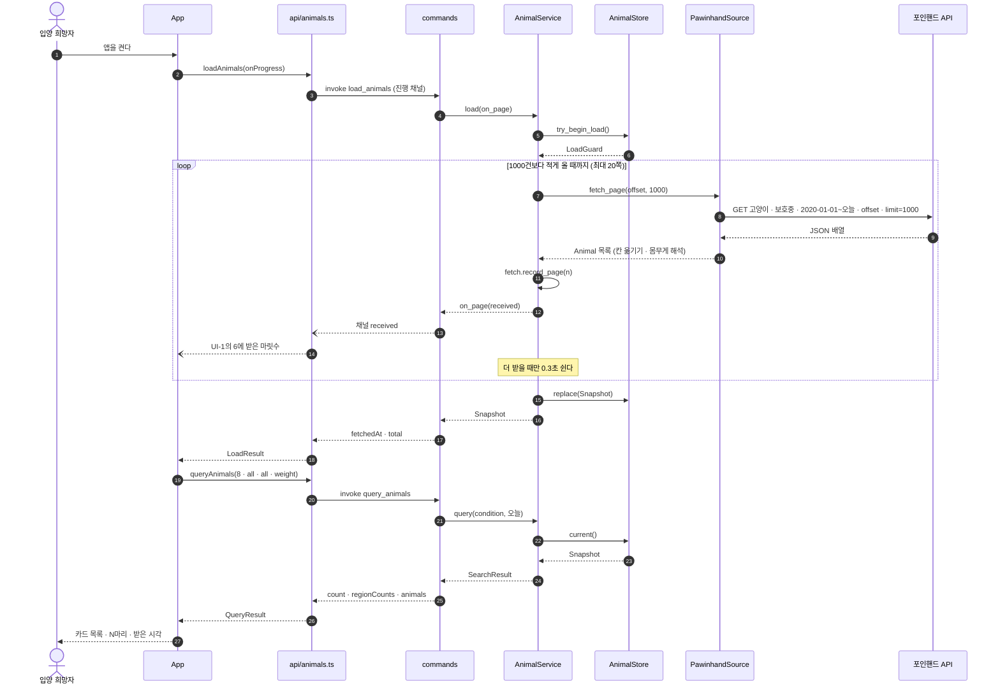
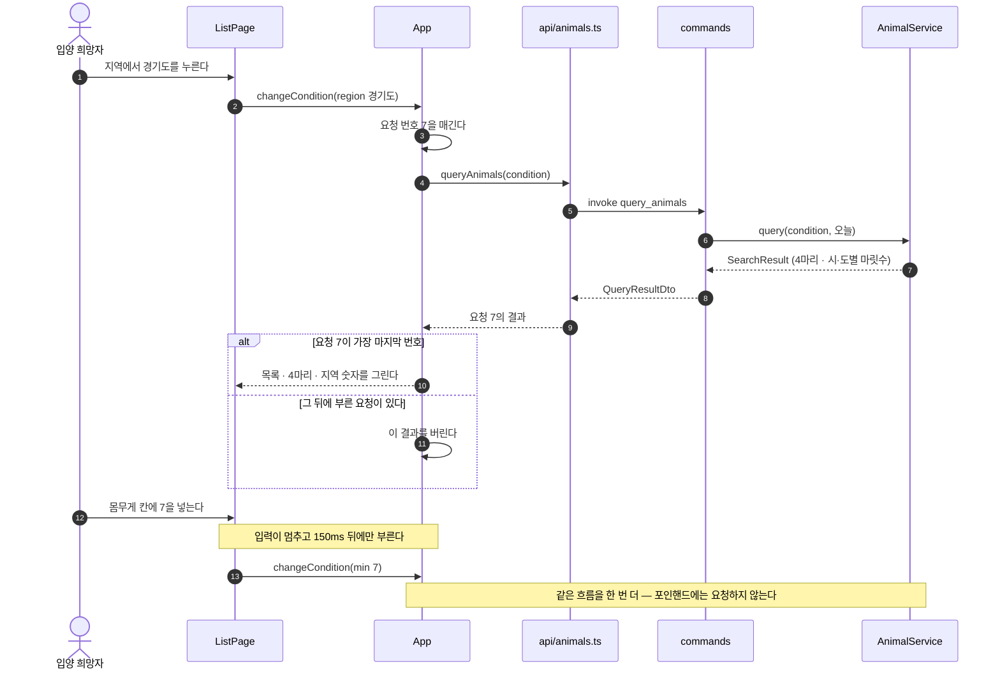
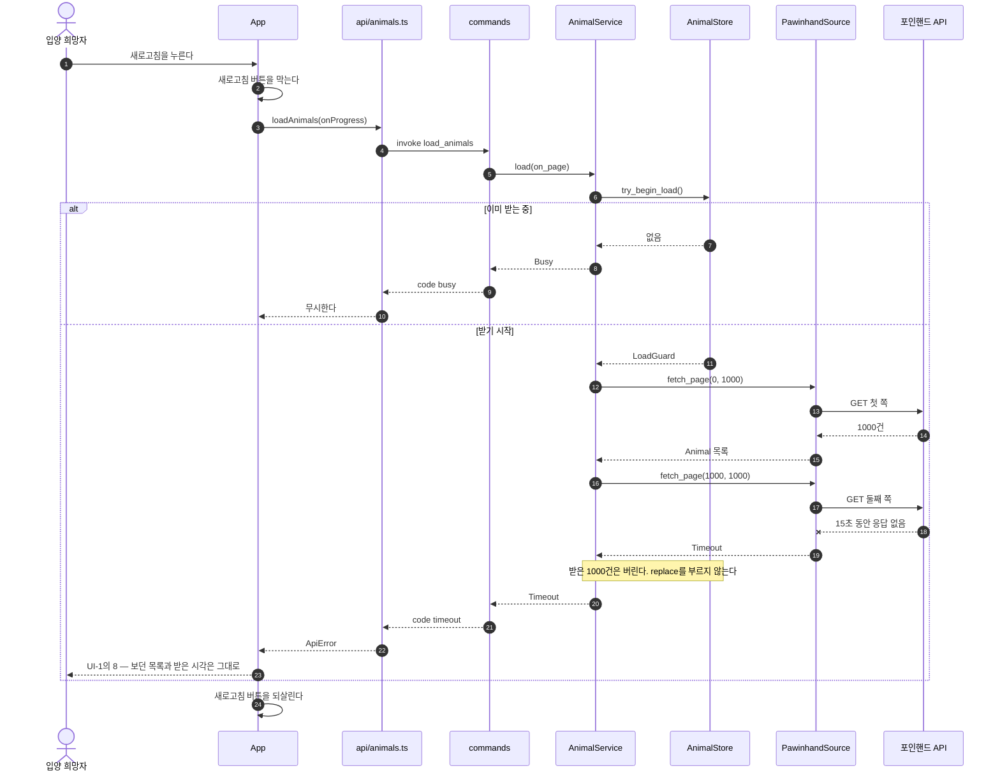
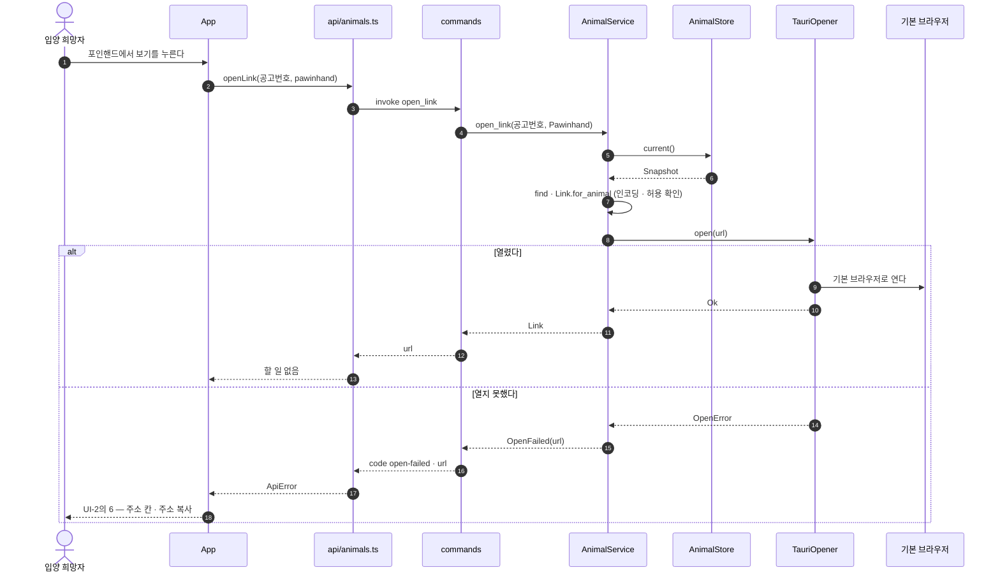
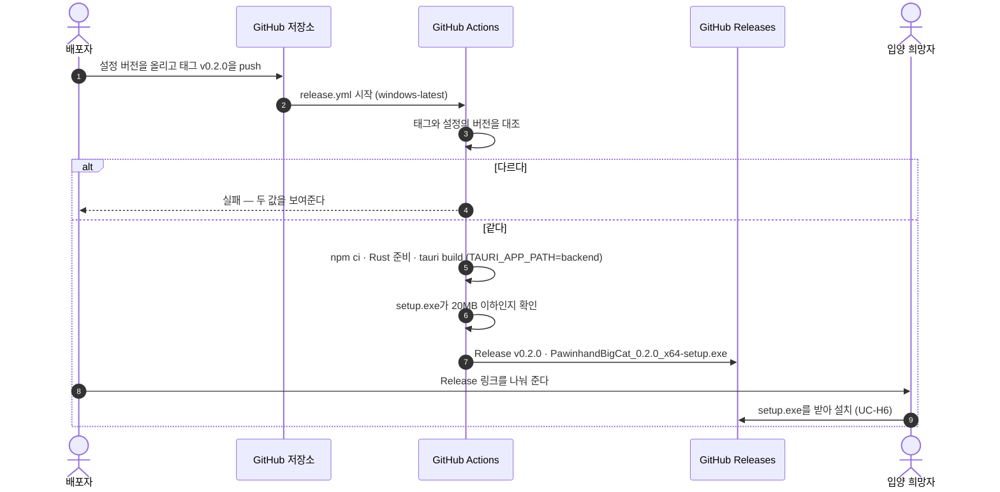

# SEQUENCE — 포인핸드 대형묘 찾기

## 0. 이 문서가 다루는 것

유스케이스의 흐름을 클래스 명세의 생명선 사이 호출로 그린다. 누가 먼저 부르는지, 목록이 언제 바뀌는지, 실패하면 어디서 멈추는지를 본다. 커맨드의 모양은 [[PAW-API-001]], 생명선의 정의는 [[PAW-DOM-002]]가 정본이다.

### 0.1 생명선

| 생명선 | 약어 | 실체 | 종류 | 정의한 곳 |
|---|---|---|---|---|
| 입양 희망자 | U | 앱을 쓰는 사람 | 액터 | [[PAW-UC-001]] 1장 |
| 목록 화면 | LP | `frontend/src/pages/ListPage.tsx` | 화면 | [[PAW-DOM-002#ListPage]] |
| 화면 상태 | APP | `frontend/src/App.tsx` | 화면 | [[PAW-DOM-002#App]] |
| 화면 쪽 호출 | API | `frontend/src/api/animals.ts` | 화면 | [[PAW-DOM-002#AnimalsApi]] |
| 커맨드 | CMD | `backend/src/domains/animal/commands.rs` | 코어 | [[PAW-DOM-002#AnimalCommands]] |
| 동물 서비스 | SVC | `AnimalService` | 코어 | [[PAW-DOM-002#AnimalService]] |
| 보관소 | ST | `AnimalStore` | 코어 | [[PAW-DOM-002#AnimalStore]] |
| 포인핸드 어댑터 | PS | `PawinhandSource` | 코어 | [[PAW-DOM-002#PawinhandSource]] |
| 포인핸드 API | PAW | `https://pawinhand.net/bridge/animals/condition` | 외부 | [[PAW-INFRA-001#C6]] |
| 브라우저 어댑터 | OP | `TauriOpener` | 코어 | [[PAW-DOM-002#TauriOpener]] |
| 기본 브라우저 | BR | 사용자 PC의 기본 브라우저 | 외부 | [[PAW-UC-001]] 1장 |

배포 흐름(SEQ-5)에는 배포자, GitHub 저장소·Actions·Releases가 따로 나온다.

## SEQ-1 켜서 받아오고 첫 목록 그리기

[[PAW-UC-001#UC-H1]] 기본 흐름 1~4, [[PAW-UC-001#UC-S1]] · [[PAW-UC-001#UC-S3]].

**읽을 때 볼 것**
- `replace`는 마지막 쪽까지 받은 뒤 **한 번만** 불린다. 받는 동안 보관소의 목록은 바뀌지 않는다([[PAW-DOM-002#AnimalStore]])
- `LoadGuard`는 `load`가 끝날 때 떨어져 「받는 중」이 풀린다. 성공이든 실패든 같다
- 진행 상태는 서비스가 아니라 커맨드가 채널로 보낸다 — 서비스는 Tauri를 모른다(클래스 명세 3장)
- 화면은 `load_animals`가 끝난 뒤에야 `query_animals`를 부른다([[PAW-API-001]] 3장). 오늘 날짜는 커맨드가 부를 때마다 읽는다

## SEQ-2 조건을 바꿔 다시 거르기

[[PAW-UC-001#UC-H2]] 기본 흐름 1~4, [[PAW-UC-001#UC-S3]].

**읽을 때 볼 것**
- 이 흐름에는 포인핸드 API가 없다. 거르기는 코어 메모리만 본다([[PAW-API-001]] 1장 「네트워크」)
- 결과가 뒤바뀌어 도착해도 가장 마지막에 부른 요청의 결과만 그린다([[PAW-DOM-002#App]])
- 숫자 칸에 잘못된 값이 들어오면 `changeCondition`을 부르지 않는다 — 화면이 먼저 막는다(UI-1의 11)

## SEQ-3 새로고침이 실패해도 보던 목록은 그대로

[[PAW-UC-001#UC-H5]] 확장 1a · 3a, [[PAW-UC-001#UC-S1]] 확장 2a.

**읽을 때 볼 것**
- 실패하면 보관소에 손대지 않는다. 그래서 화면은 `query_animals`를 다시 부를 필요가 없다([[PAW-API-001]] 3장)
- 중간 실패도 전체 실패다 — 1000건을 받아 둔 채 목록을 반쯤 바꾸지 않는다([[PAW-UC-001#UC-H1]] 2b)
- 처음 켤 때의 실패도 같은 흐름이고, 화면만 UI-1의 7로 다르다

## SEQ-4 원래 공고 페이지 열기

[[PAW-UC-001#UC-H4]] 기본 흐름·확장, [[PAW-UC-001#UC-S4]].

**읽을 때 볼 것**
- 주소는 서비스가 만든다. 화면은 공고번호와 종류만 넘긴다 — 화면에는 링크 열기 권한이 없다([[PAW-INFRA-001]] 5장)
- 목록 카드에서 눌러 실패했을 때도 같은 흐름이고, 화면은 그 아이의 UI-2를 열어 알린다([[PAW-UI-001#UI-1]] 규칙)
- 원문 번호가 없는 아이는 원문 링크 자체가 보이지 않아 `no-source`까지 오지 않는다

## SEQ-5 새 버전 배포

[[PAW-UC-001#UC-A1]] 기본 흐름·확장.

**읽을 때 볼 것**
- 빌드·크기 확인 중 하나라도 실패하면 Release가 생기지 않는다([[PAW-UC-001#UC-A1]] 2a)
- 버전은 설정 한 곳에서만 오고, 태그는 그 값과 같아야 한다([[PAW-INFRA-001]] 8.4)

## 1. 대응표

| 시퀀스 | 유스케이스 | 커맨드 | 화면 |
|---|---|---|---|
| SEQ-1 | UC-H1 · UC-S1 · UC-S3 | `load_animals` → `query_animals` | UI-1 |
| SEQ-2 | UC-H2 · UC-S3 | `query_animals` | UI-1 |
| SEQ-3 | UC-H5 · UC-S1 | `load_animals` | UI-1 |
| SEQ-4 | UC-H4 · UC-S4 | `open_link` | UI-1 · UI-2 |
| SEQ-5 | UC-A1 · UC-H6 | — | — |

화면이 없는 유스케이스 UC-S2(몸무게 해석)는 SEQ-1의 「칸 옮기기 · 몸무게 해석」 안에 있고, UC-H3(상세 보기)은 코어를 부르지 않아(결과에 이미 모든 정보가 있다) 시퀀스가 없다.

## 2. 되먹일 것

그려 보니 기존 명세와 어긋난 곳은 없다. 확인한 것만 적는다.

- 진행 상태가 서비스 → 커맨드 → 채널로 가는 길이 [[PAW-DOM-002]] 3장 「service는 Tauri를 모른다」와 맞는다
- 새로고침 실패 뒤 화면이 `query_animals`를 부르지 않아도 되는 이유(보관소가 그대로다)가 [[PAW-API-001]] 3장 표와 맞는다
- 상세 보기(UC-H3)는 커맨드를 부르지 않는다 — [[PAW-API-001]] 2.4 「상세를 따로 묻는 커맨드는 없다」와 맞는다

## 3. 미결사항

- [x] 없음
